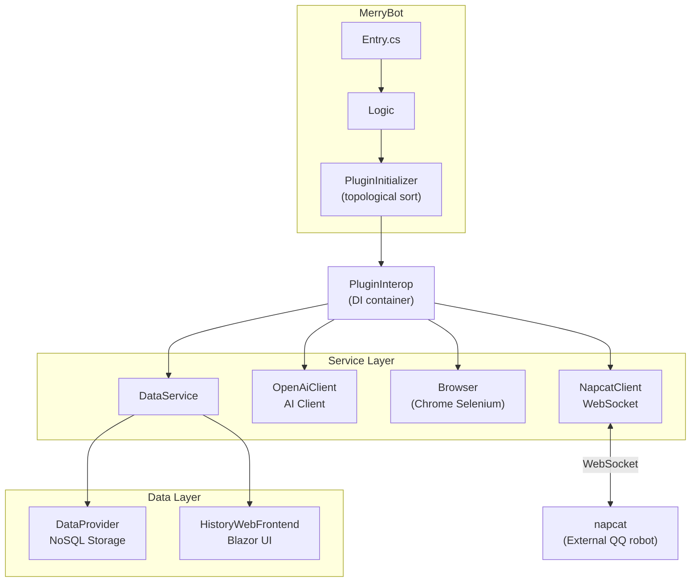
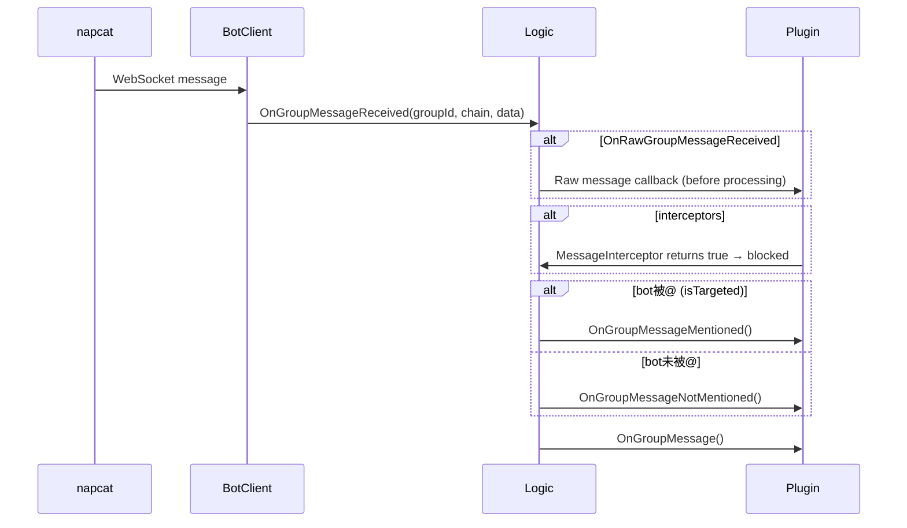

# CLAUDE.md

This file provides guidance to Claude Code (claude.ai/code) when working with code in this repository.

## Build and Run Commands

```bash
# Build the solution
dotnet build MerryBot.sln

# Run MerryBot (development)
cd MerryBot && dotnet run

# Watch mode (auto-rebuild on changes)
dotnet watch run --project MerryBot/MerryBot.csproj

# Publish and run (Linux, from repo root)
./launch.sh

# The launch.sh script:
# 1. Auto-detects architecture (linux-x64 / linux-arm64)
# 2. Publishes HistoryWebFrontend first to generate wwwroot
# 3. Publishes MerryBot with Release configuration
# 4. Copies wwwroot to MerryBot's publish directory
# 5. Runs MerryBot, auto-restarts on exit code 101 (git fetch/merge) or 102 (reload)

# Run ad-hoc tests (no test framework, console app)
cd Test && dotnet run
```

**Environment variables**:
- `MERRY_BOT` — data directory path (defaults to `data` in working directory)
- `CHROME_BIN` — path to Chrome/Chromium binary (if not in system PATH)

**Exit codes** (defined in `CommonLib/ExitCode.cs`): 101 = restart (recompile), 102 = reload (no recompile).

**Target framework**: .NET 10.0 across all projects.

## Architecture Overview

MerryBot is a QQ bot framework based on napcat, using C# with .NET 10.



## Project Structure

| Project | Purpose |
|---------|---------|
| `MerryBot/` | Entry point, plugin loading, event routing |
| `NapcatClient/` | WebSocket client for napcat protocol |
| `plugins/` | Plugin base class and implementations |
| `OpenAiClient/` | OpenAI-compatible AI client with function calling |
| `Browser/` | Chrome automation via Selenium |
| `CommonLib/` | Shared utilities (logging, HTTP, formatting) |
| `DataProvider/` | NoSQL plugin storage database |
| `DataService/` | History recording, file storage |
| `HistoryWebFrontend/` | Blazor web UI for viewing chat history |
| `Markdown2Html/` | Markdown to HTML converter |

## Plugin System

**Plugin loading**: `PluginInitializer` performs topological sort based on constructor dependencies. Priority field in `PluginTag` affects load order (higher = later). Key priorities: `storage-manager` (999), `extra-models` (1000), `main-plugin` (1919810).

**Plugin requirements**:
1. Inherit from `BotPlugin.Plugin`
2. Have exactly one constructor with `PluginInterop` parameter (for dependency injection)
3. Decorate class with `[PluginTag(id, name, description, isIgnore, priority, type)]`

**Plugin types** (`PluginType` enum): `Interactive` (default), `Background`, `Admin`

**Message flow**:



**Key interfaces** (`plugins/_interface.cs`):
- `Plugin` - base class with `OnGroupMessage*`, `OnNoticeEvent*` virtual methods
- `PluginInterop` - dependency injection, config access, `FindPlugin<T>()`, `PluginStorage`
- `PluginInfo` - `(Instance, PluginTag, Interop)` record
- `PluginStorage` - async `Load<T>()` / `Save<T>(data)` per plugin namespace

**Large classes use partial classes** to split across files: `AiMessage` (3 files), `Logic` (4 files), `OpenAiCompatible` (3 files).

## Configuration (`setting.toml`)

TOML format, managed by `ConfigManager` (Tomlyn library, preserves comments). Key sections:
- `napcat-server`, `napcat-token` - napcat WebSocket connection
- `qq-groups` - list of monitored group IDs
- `authorized-user` - privileged QQ号 for admin operations
- `variables.<plugin-id>.*` - per-plugin configuration namespace

**Plugin config access**: `interop.GetVariable<T>(key)` / `interop.GetClassVariable<T>(key)` / `interop.SetVariable(key, value)`

## LlmService and Model Management

`LlmService` is a `Background` plugin that centralizes model/token management:
- `ResolveModel(name?)` — resolves model by `ModelTag` (`{provider}/{model}` format), falls back to default
- `GetToken(modelPreset)` — fetches API token from config using key pattern `ai-token-{provider}`

**ModelPreset** (`OpenAiClient/ModelPreset.cs`): static registry of model configurations. `ModelTag` format is `{provider}/{model}` (e.g., `deepseek/deepseek-v4-flash`). Custom models can be added via `{dataPath}/extra-models.toml` (loaded by `ExtraModels` plugin at priority 1000).

## OpenAiClient Notes

**Message serialization**: `AssistantMessage.ToolCalls` is nullable with `[JsonIgnore(Condition = WhenWritingNull)]`. When creating an `AssistantMessage` for tool calls, explicitly initialize `ToolCalls = new()`. The API rejects empty `"tool_calls": []`.

**History management**: Sliding window (default 30 messages). Trim point advances past `tool` role messages to avoid splitting `tool_calls`/`tool` pairs. System prompt at index 0 is always preserved. Auto-resets conversation after 12 hours of inactivity (`AutoNewSpan`).

**Function calling flow**: Tool calls execute in parallel via `Task.WhenAll`. `ToolBehavior.ExitAfterUse` throws after tool execution to stop the conversation loop. Per-group mutex prevents concurrent requests.

**Dynamic prompt system**: When `UseDynamicPrompt` is true (default), system prompt is rebuilt each conversation with base prompt + timestamp + tool-injected content (e.g., memory system key list).

## Browser / Chrome Setup

Chrome is used for Markdown rendering, web search, and page summarization via Selenium.

- Set `CHROME_BIN` env var if Chrome is not in system PATH
- On Linux ARM64, chromedriver must be at `/usr/bin/chromedriver`
- Auto-closes after 5 minutes of inactivity (`ResourceCountdown`)
- Anti-detection stealth mode enabled by default

Linux font requirements for CJK/Emoji rendering:
```bash
sudo apt-get install -y fonts-noto-color-emoji fonts-noto-cjk
sudo apt install fonts-noto-cjk-extra fonts-hanazono
sudo fc-cache -fv
```

## Code Style

`.editorconfig` enforces: LF line endings, 4-space indent, block-scoped namespaces, explicit `var` usage disabled.
