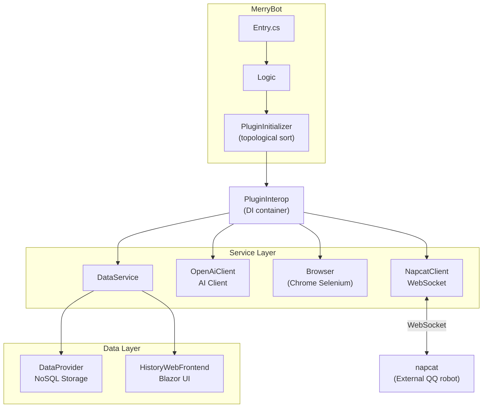
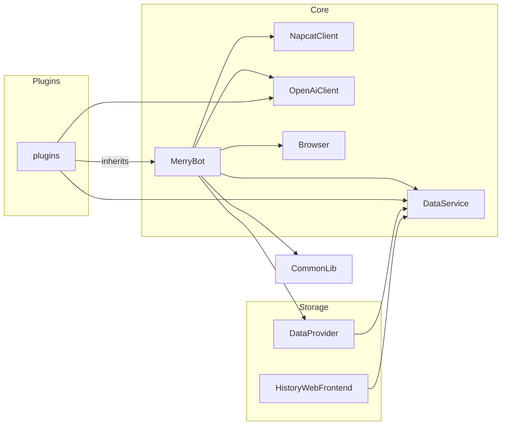
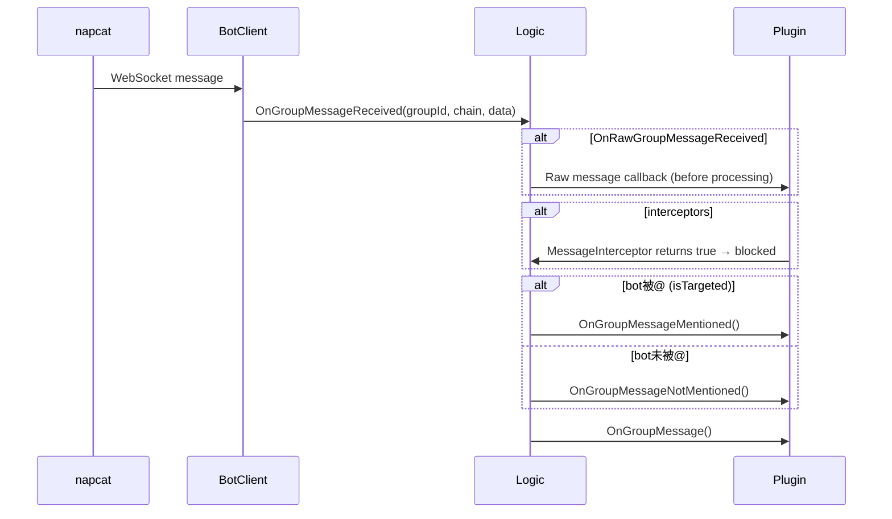

# CLAUDE.md

This file provides guidance to Claude Code (claude.ai/code) when working with code in this repository.

## Build and Run Commands

```bash
# Build the solution
dotnet build MerryBot.sln

# Run MerryBot (from MerryBot directory after publishing)
cd MerryBot && dotnet run

# Publish all projects (from repo root, Linux)
./launch.sh

# The launch.sh script:
# 1. Publishes HistoryWebFrontend first to generate wwwroot
# 2. Publishes MerryBot with Release configuration
# 3. Copies wwwroot to MerryBot's publish directory
# 4. Runs MerryBot, auto-restarts on exit code 101 (git fetch/merge) or 102 (reload)
```

**Environment variable**: `MERRY_BOT` points to the data directory (defaults to `data` in working directory).

**Exit codes**: 101 = restart (recompile), 102 = reload (no recompile).

## Architecture Overview

MerryBot is a QQ bot framework based on napcat, using C# with .NET 10.



## Project Structure



| Project | Purpose |
|---------|---------|
| `MerryBot/` | Entry point, plugin loading, event routing |
| `NapcatClient/` | WebSocket client for napcat protocol |
| `plugins/` | Plugin base class (`Plugin`, `PluginInterop`, `PluginTag`) and implementations |
| `OpenAiClient/` | OpenAI-compatible AI client with function calling |
| `Browser/` | Chrome automation via Selenium for Markdown rendering |
| `CommonLib/` | Shared utilities (logging, HTTP, formatting) |
| `DataProvider/` | NoSQL plugin storage database |
| `DataService/` | History recording, file storage |
| `HistoryWebFrontend/` | Blazor web UI for viewing chat history |
| `Markdown2Html/` | Markdown to HTML converter |

## Plugin System

**Plugin loading order**: `PluginInitializer` performs topological sort based on constructor dependencies.

**Plugin requirements**:
1. Inherit from `BotPlugin.Plugin`
2. Have exactly one constructor with `PluginInterop` parameter (for dependency injection of other plugins)
3. Decorate class with `[PluginTag(id, name, description, isIgnore, priority, type)]`

**Message flow**:



**Key interfaces** (`plugins/_interface.cs`):
- `Plugin` - base class with `OnGroupMessage*`, `OnNoticeEvent*` virtual methods
- `PluginInterop` - dependency injection, config access, `FindPlugin<T>()`, `PluginStorage`
- `PluginInfo` - `(Instance, PluginTag, Interop)` record
- `PluginStorage` - async `Load<T>()` / `Save<T>(data)` per plugin namespace

**Plugin examples**: `plugins/About.cs`, `plugins/AutoIncrease.cs`, `plugins/Highlights.cs`

## Configuration (`setting.toml`)

TOML format. Key sections:
- `napcat-server`, `napcat-token` - napcat WebSocket connection
- `qq-groups` - list of monitored group IDs
- `authorized-user` - privileged QQ号 for admin operations
- `variables.<plugin-id>.*` - per-plugin configuration namespace

**Plugin config access**: `interop.GetVariable<T>(key)` / `interop.GetClassVariable<T>(key)` / `interop.SetVariable(key, value)`
