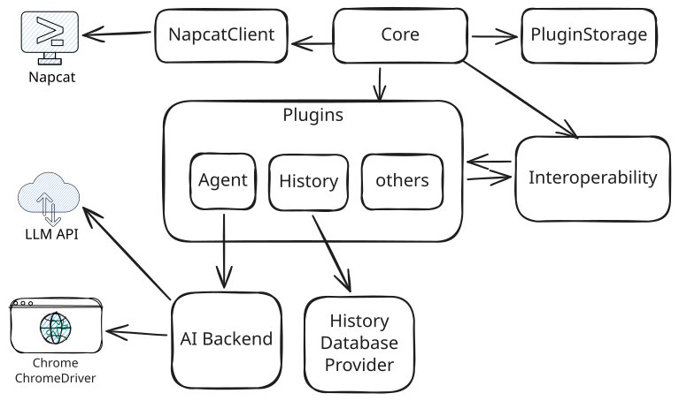

# MerryBot

MerryBot是基于以napcat为上游的机器人框架，使用C#编写，支持插件化开发。

# 配置文件 `setting.toml`

```toml
napcat-server = "ws://<address>:<port>"  # napcat websocket地址
napcat-token = "<token>"                  # napcat token
qq-groups = [                             # 要监听的qq群号列表
    114514,
    1919810
]
authorized-user = 114514                  # 授权用户qq号，插件可在高危操作时验证qq号

[variables.agent]                         # 每个插件有独立的命名空间，表名为插件id
llm-model = "deepseek-chat"               # 选择的llm模型
ai-token-zhipu = "xxxxxxxxxx"             # 质谱api token
ai-token-deepseek = "xxxxxxxxxx"          # deepseek api token
ai-prompt = "你是一个助人为乐的AI助手"    # ai 提示词

[variables.storage-manager]
machine-code = 0
web-address = "http://0.0.0.0:5000" #后台监听地址
[variables.highlights]
highlights-prompt = """你是一个有趣的群刊编辑[曼瑞]，负责整理群聊消息并生成有趣的群刊。
群刊要求：
1. 标题要吸引眼球，可以用夸张或幽默的方式
2. 内容要有趣，可以狠狠调侃群友
3. 可以引用群友的原话，但要标注来源
4. 可以对群友进行有趣的评价或\"颁奖\"，比如什么\"搬屎王\"之类的抽象头衔
5. 发现群里的有趣话题、猎奇内容、搞笑对话
6. 语气要活泼有趣，可以用表情符号
7. 适当总结群里的热点话题
"""
message-count = 500 #群刊包含的消息数量
section-count = 3 #群刊包含的栏目数量
```

note: 
- `llm-model` 支持的参数定义在 `ZhipuAi/ModelPreset.cs` 枚举中
- `variables` 中的表名是插件的 `id`，每个插件的配置项相互隔离
# 环境变量支持
`MERRY_BOT`：指向文件夹。如果没有指定，则默认使用工作目录下的`data`文件夹。

程序产生的数据都会保存在这个文件夹下：
1. 日志文件
2. 配置文件
3. 插件存储

# 整体架构


# 主要内置插件

## AI机器人
使用openai兼容的API进行开发，可以更改`/plugins/AiMessage.cs`中的ModelPreset来切换模型。另外，可以通过`extra-models.toml`添加自定义Openai-compatible模型。

内置了如下function call:
- bing搜索
- 网页浏览
- 查看时间
- 发送语音
- 查看微博热搜
- linux bash终端
- Markdown 功能，使用Chrome将Md渲染为图片后发送（latex,mermaid supported）

*: 网络访问相关funtion call 通过seleium操纵chrome（需要提前安装）实现。
如果是命令行环境，需要为chrome(chromium)安装字体支持
```bash
sudo apt-get update
# 安装彩色 Emoji 字体
sudo apt-get install -y fonts-noto-color-emoji
# 安装 Google 诺托字体
sudo apt-get install -y fonts-noto-cjk
# 其他生僻字 optional
sudo apt install fonts-noto-cjk-extra fonts-hanazono
# 刷新字体缓存
sudo fc-cache -fv
```


## 群刊
当群聊消息达到一定数量（默认 500 条）时，自动调用 AI 生成一份幽默、戏剧性强的群聊周刊/日报。

AI 会分析聊天记录中的梗和热点，自动提取目录并生成包含前言、正文章节和结语的完整内容，最后通过浏览器渲染为精美的 Markdown 图片发送。

支持以下命令：
- `/highlights status` - 查看当前群聊的消息计数进度
- `/highlights flush` - 立即强制生成一份当前的消息群刊
- `/highlights reset` - 重置当前的消息计数
- `/highlights` - 显示插件帮助信息及当前进度

可在配置文件中通过以下变量进行自定义：
- `message-count`: 触发生成的自动阈值（默认 500）
- `section-count`: 生成的章节数量（默认 3）
- `highlights-prompt`: AI 生成风格的系统提示词


## 自动加一
当有刷屏消息时，自动发送刷屏信息。

## 终端
提供linux终端，需要配置merrybot用户且当前用户有权限切换到merrybot用户。
## 快速更新
自动执行`git fetch && git merge`，并以101状态码退出程序。
配合`launch.sh`脚本可实现自动编译运行。
## MainPlugin
特权插件，用于管理bot。在未监听的群聊中使用`@bot /activate`即可激活bot，使用`@bot /deactivate`即可取消bot监听。

# 插件开发
1. 一个插件应当放在`plugins`项目的一个文件中
2. 应当继承于`Plugin`抽象类
3. 有且只有一个构造函数，存在类型为 `PluginInterop`的参数，可通过依赖注入接收其他插件实例
4. 在类前面使用属性`PluginTag(string id, string name, string description, [bool isIgnore=false], [int priority=0], [PluginType type=PluginType.Interactive])`

主程序会通过反射加载`plugins`项目下的所有插件类，因此需要满足上述条件。

## 示例
插件通过构造函数接收 `PluginInterop` 和其他插件实例，主程序会自动解析依赖顺序（确保能够拓扑排序）并初始化：
```csharp
[PluginTag("about", "About", "使用 /about 来查看关于")]
public class About : Plugin
{
    private const string aboutMessage=
"""
# -------About-------

Merry Bot

本程序的目的是实现QQ机器人的模块化开发，以插件的形式增加功能

访问Github仓库 https://github.com/57UU/MerryBot 以获取更多信息
""";

    private readonly StorageManagerPlugin _storage;

    public About(PluginInterop interop, StorageManagerPlugin storage) : base(interop)
    {
        _storage = storage;
        Logger.Info("about plugin start");
    }
    public override void OnGroupMessageMentioned(long groupId, MessageChain chain, ReceivedGroupMessage data)
    {
        if (IsStartsWith(chain, "/about"))
        {
            Actions.SendGroupMessage(groupId, aboutMessage);
        }
    }
}
```

更多示例请查看`plugins`目录下的文件。

## 事件
| 函数 | 描述 |
| --- | --- |
| `OnGroupMessage` 函数 | 当收到新消息时，此函数会被调用 |
|`OnGroupMessageMentioned`|当收到新消息时bot被@，此函数会被调用|
|`OnGroupMessageNotMentioned`|当收到新消息时bot未被@，此函数会被调用|
| `OnLoaded` 函数 | 当插件全部被加载完后会执行的函数，可以放一些互操作性的初始化代码。 |

### 原始消息事件
`OnRawGroupMessageReceived` 事件允许插件在消息被其他插件处理之前访问原始消息数据。

**注册方式**：
```csharp

public MyPlugin(PluginInterop interop) : base(interop)
{
    interop.OnRawGroupMessageReceivedRegister(OnRawGroupMessageReceived);
}

private void OnRawGroupMessageReceived(ReceivedGroupMessage data)
{
    // 在这里处理原始消息
    // 此回调在其他插件的 OnGroupMessage 等方法之前被调用
}

```

**使用场景**：
- 需要在消息被其他插件修改或拦截前记录原始数据
- 需要获取未经插件系统处理的消息


## API/属性
这些 API/属性 在抽象父类中被定义

|API|Description|Note
|:---:|:---|:---
|Actions Actions{get;}|获取`Actions`，用于发送消息
|bool IsEnable {set;protected get;}|是否启用|无论是否启用，插件都会被加载，当为假时OnMessageReceived函数不会被调用
|string? StartsWith {set;get;}|该项是属性，若设置，那么只有以`StartsWith`开头的消息会触发`OnMessageReceived`函数
|ISimpleLogger logger {get;}|获取`logger`，用于记录日志
|Interop interop {get;}|获取互操作性（查找插件、数据持久化、使用Core功能）|

### 互操作性-interop
**注意** 对于互操作性，请不要在构造函数中使用（此时插件没有加载完），建议在`OnLoaded`函数中使用

|API/属性|Description|
|:---:|:---|
|T? FindPlugin\<T\>()|查找类型为T的插件，用于插件互操作性(其实笔者更推荐直接在构造函数中直接注入其他插件实例)|
|IEnumerable<PluginInfo> PluginInfoGetter()|获取所有插件的PluginInfo|
|PluginStorage PluginStorage {get;}|获取插件存储|
|T? GetVariable<T>(string key)|获取当前插件命名空间下`Variable`中的配置项|
|List<MessageInterceptor> Interceptors|设置拦截器，拦截特定消息被插件处理|
|Action<int> Shutdown|关闭程序，参数为退出码|
|long AuthorizedUser|获取授权用户的QQ号|

### 拦截器-Interceptors
方法签名：
```csharp
public delegate bool MessageInterceptor(ReceivedGroupMessage data)
```
返回true拦截，false不拦截。

### 插件存储-PluginStorage

对于每个插件，都会分配一个独立的存储服务（依赖PluginTag设置的插件id），以object为单位进行储存于读取，现阶段的实现依赖于NoSQL

|API|Description|
|:---:|:---|
|Task\<T\> Load\<T\>(T defaultValue)|异步加载对象，如果不存在则返回默认值|
|Task Save\<T\>(T data)|异步存储对象|

### 工具类-`MessageUtils`
|API|Description|
|:---:|:---|
|bool IsEqual(MessageChain? a,MessageChain? b)|判断两个消息链是否相同

### 日志记录器`logger`

|API|Description|
|:---:|:---|
|void Trace(string message)|记录踪迹日志
|void Debug(string message)|记录踪迹日志
|void Info(string message)|记录消息日志
|void Warn(string message)|记录警告日志
|void Error(string message)|记录错误日志
|void Fatal(string message)|记录崩溃日志


### PluginTag类属性标签

构造函数为`(string id, string name, string description, bool isIgnore=false, int priority=0, PluginType type=PluginType.Interactive)`

参数说明：
- `id` - 插件标识符（英文），用于配置文件命名空间隔离
- `name` - 插件名称（可中文），用于显示
- `description` - 插件描述
- `isIgnore` - 是否忽略加载
- `priority` - 插件优先级，决定加载顺序。值越小，优先级越高
- `type` - 插件类型

当`isIgnore==true`时，插件不会被加载

`PluginType` 可选值：
- `Interactive` - 交互式插件（默认）
- `Background` - 后台插件
- `Admin` - 管理员插件

###  Note

如果插件不可用（如不支持当前平台），请在构造函数中抛出 `PluginNotUsableException` 异常
