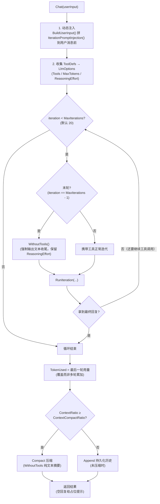
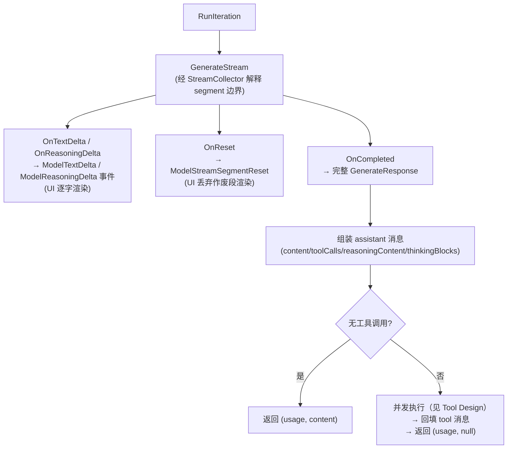

# Agentic Loop

Agentic Loop 是对话的核心循环：**生成 → 若请求工具则执行并回填 → 再生成**，直到模型输出最终文本或达到迭代上限。代码位于 `Agent/Agent.cs`（`Chat` 主循环）与 `Agent/Agent.RunIteration.cs`（单轮迭代）。

## 主循环（`Chat`）

```csharp
public async Task<(string result, TokenUsage tokenUsage)> Chat(string userInput, CancellationToken ct)
{
    // 1. 用户消息前拼上各 ToolSet 的动态注入（BuildUserInput）
    // 2. 收集 ToolDefs → LlmOptions（Tools/MaxTokens/ReasoningEffort）
    for (int iteration = 0; iteration < options.MaxIterations; iteration++)  // 默认 20
    {
        // 最后一次迭代 WithoutTools()：强制模型直接输出文本，避免收尾失败
        // （必须保留 ReasoningEffort：anthropic 开启 thinking 后历史含思考块，
        //   突然关闭 thinking 会被 API 拒绝）
        (usage, iterationResult) = await RunIteration(...);
        if (iterationResult != null) { result = iterationResult; break; }
    }
    // 3. 循环结束：评估上下文压缩（见下）
    // 4. 未压缩则 Append 持久化历史；空回复给占位提示
    return (result, totalUsage);
}
```

主循环的控制流：



### 关键设计决策

- **循环内不做上下文压缩**：工具调用轮次刚把 tool 结果回填进消息列表，模型还需基于精确消息继续推理，此时压缩会把工具链替换成摘要、打断后续工具调用
- **上下文占用 = 最后一轮用量（覆盖而非多轮累加）**：工具多轮迭代中每一轮输入都包含完整上下文，累加 `totalUsage` 会虚高 N 倍、过早触发有损压缩；以最后一次请求的 prompt+completion 衡量，宁可略早触发，不冒工具链上下文超出模型上限的风险
- 空回复（空 content 且无工具调用）给调用方返回占位提示 `（模型未返回内容）`，避免上层表现为"无回复"

## 单轮迭代（`RunIteration`）



`StreamCollector`（`Agent.RunIteration.cs` 内嵌类）是 segment 解释器：首个增量发 `ModelStreamSegmentStart`（attempt 从 1 起），`OnReset` 发 `ModelStreamSegmentReset` 并推进 attempt。

## 上下文三件套

| 组件 | 文件 | 职责 |
| --- | --- | --- |
| `Context` | `Agent/Context.cs` | `Messages`（消息列表）+ `TokenUsed`（估算占用）；`Fork()` 复制上下文（压缩用） |
| `ContextManager` | `Agent/ContextManager.cs` | `TokenLimit` / `ContextRatio` / `Compact`；`Create` 时恢复历史 |
| `ContextHistory` | `Agent/ContextHistory.cs`（接口） | `Restore` / `Append` / `Replace` / `Clear` 持久化；实现 `DatabaseContextHistory` 在 `plugins/Agent.ContextHistory.cs`（存 `agent` scope） |

### 上下文压缩

对话结束时若 `ContextRatio >= ContextCompactRatio`（默认 0.7）触发压缩，把长对话压缩为**保留在上下文中的稳定摘要**（[缓存友好压缩](compaction.html)）；`CompactAsync(ct, topic)` 可手动触发（TUI `/compact`、群聊命令），`ResetAsync()` 清空会话（TUI `/new`）。详见[缓存友好压缩](compaction.html)。

## 配置项（`AgentOptions`）

| 配置 | 默认值 | 说明 |
| --- | --- | --- |
| `SystemPrompt` | `"You are a helpful assistant."` | 系统提示（构造时拼接各 ToolSet 静态提示） |
| `MaxIterations` | 20 | 单次 Chat 最大迭代轮数 |
| `ContextCompactRatio` | 0.7 | 触发压缩的上下文占用比 |
| `MaxOutputTokens` | null | 输出 token 上限 |
| `MaxConcurrentToolCalls` | 4 | 单轮并行工具调用上限（超限排队串行） |
| `ReasoningEffort` | null | 深度思考档位（"low"/"medium"/"high"，仅 anthropic 格式生效，映射 thinking budget_tokens） |
| `OnLog` | null | best-effort 生命周期回调（异常被忽略，可观测性不影响对话） |
| `OnMessageRecorded` | null | 消息审计回调（每条 user/assistant/tool 消息产生时触发，异常忽略） |

## 事件流（`AgentLogEvent`）

Agent 在对话过程中持续发布诊断事件（ChatStarted → ModelRequest → ModelTextDelta/ReasoningDelta → ToolCallStarted/Completed/Failed → ChatCompleted/Failed，含 ContextCompaction），详见[事件流](events.html)。

## 相关页面

- [LLM 请求](llm-request.html) — 底层请求与重试
- [Tool Design](tool-design.html) — 工具注入与回调
- [缓存友好压缩](compaction.html) — 上下文压缩与 cache 复用
- [事件流](events.html) — AgentLogEvent 诊断事件
- [框架核心](../architecture/index.html) — 消息入口与日志
