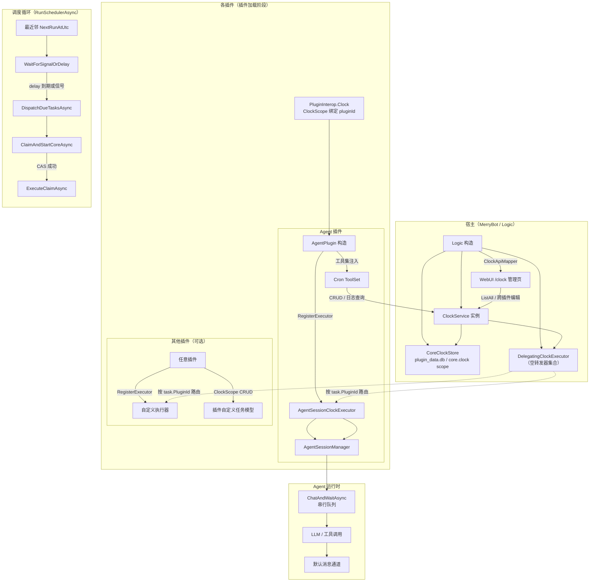

# 定时任务（ClockService）

`ClockService` 是宿主拥有的共享 cron 调度器，**按 `(pluginId, sessionId)` 双重所有权边界共享给所有插件**：插件经 `PluginInterop.Clock`（`ClockScope` 门面，构造时绑定本插件 Id）访问，只能看到和管理自己的任务。`Cron` 只是 Agent 会话上的工具门面。任务持久化在 core 的 `clock` scope；`ClockTask.Content` 为 `object?`（可为 null 或插件自定义模型）。WebUI 提供 `/clock` 管理页（跨插件查看/编辑/启停/删除 + 执行日志）。

> 代码入口：`Agent.Session/ClockService.cs` 调度器，`Agent.Session/ClockScope.cs` 插件门面，`MerryBot/ClockStore.cs` LiteDB 持久化（弱类型读取 + v1→v2 迁移），`Agent.Session/Cron.cs` LLM 工具集，`MerryBot.WebUI/Api/ClockApiMapper.cs` + `Components/Pages/ClockTasks.razor` 管理端。

---

## 1. 整体架构



### 设计取舍总览

| 维度 | 选择 | 理由与边界 |
| --- | --- | --- |
| 进程模型 | 单进程单实例；共享库 + 宿主状态 | 面向一个机器人进程的场景，不做跨进程协调 |
| 调度器归属 | 宿主（core）拥有并先于插件启动 | 保证调度器与插件加载顺序无关，便于 Dispose 阶段统一收敛 |
| 插件隔离 | `ClockTask.PluginId` 字段 + `ClockScope` 门面过滤 | 逻辑隔离（与 PluginDatabaseScope 的 scope 命名隔离等效），插件只能看到自己的任务 |
| 执行者归属 | 各插件经 `RegisterExecutor(pluginId, executor)` 注册，按 `task.PluginId` 路由 | 调度器不依赖任何插件；插件未加载时其任务只会失败落日志 |
| 持久化模型 | LiteDB 三表 + scope 前缀 `core`；schema v2 | 与插件数据物理隔离，避免被插件误清理；v1 存量迁移归属 `agent` |
| Content 类型 | `object?`（null / string / 插件自定义 POCO） | 存储弱类型读取：插件类型被删除后降级为 JSON 文本，不拖垮调度器启动 |
| 领取互斥 | 进程内 Semaphore + CAS 比较 `NextRunAtUtc` | 单实例防重足够；多实例共享 DB 需外部分布式锁 |
| misfire 策略 | skip + 日志（不补跑） | 避免重启风暴，保证幂等；需要补偿应在业务层处理 |
| 重叠策略 | skip + `overlap` 日志（不排队） | 执行体不具备重复入语义，防止同任务多副本并发 |
| 时区处理 | 默认 `Asia/Shanghai`，IANA→Windows 映射兜底 | cron 字段按本地时区解释，存储与比较全部用 UTC |
| 容错粒度 | 任务级：单任务异常不杀调度循环 | 调度器级：单轮异常记日志后继续下一轮 |
| 停机收敛 | 关调度 → 等在飞任务最多 5 s → 放行退出 | 不观察取消的执行器不得阻塞进程退出 |

---

## 2. 装配层次与生命周期

### 2.1 宿主层先行建壳

`Logic` 构造函数在 `LoadPlugins()` 之前就完成调度器与存储的装配：

```csharp
// MerryBot/Logic.cs
clockStore = new CoreClockStore(PluginStorageDatabase.CreateScope("clock", prefix: "core"));
clockService = new ClockService(clockStore, new DelegatingClockExecutor());
// 定时任务管理端 API（core 拥有调度器，跨插件列出/编辑；插件侧经 PluginInterop.Clock 隔离访问）
ClockApiMapper.Map(webUiApplication, clockService);
_ = StartClockAsync();
LoadPlugins();
```

- 存储走 `CreateScope("clock", prefix: "core")`，即 `PluginStorageDatabase` 中带 `core.` 前缀的集合名，与插件自己的对象数据隔离。core.clock scope 不在插件的 DropCollection 能力范围内。
- 执行器是一个空的 `DelegatingClockExecutor`（内部空字典），此时到点任务的 `ExecuteAsync` 会立即返回 `Failure($"定时任务执行器未注册（插件 {task.PluginId} 未加载）")`—— 不会卡死、不会抛异常，但落一条失败日志。
- `StartClockAsync` 作为 async void 风格的后台 Task 启动，异常只记 NLog 日志而不冒泡；这样即使迁移、加载或调度循环启动失败，主程序仍然继续运行插件和消息适配器。

具体装配路径：

| 阶段 | 代码位置 | 职责 |
| --- | --- | --- |
| 构造 CoreClockStore | [Logic.cs L63](file:///e:/Projects/VSProj/MerryBot/MerryBot/Logic.cs#L63) | 建集合句柄（强类型 + BsonDocument 双视图），尚未建索引/写 meta |
| 构造 ClockService | [Logic.cs L64](file:///e:/Projects/VSProj/MerryBot/MerryBot/Logic.cs#L64) | 仅赋依赖，不启动调度线程 |
| 注册管理端 API | [Logic.cs L66](file:///e:/Projects/VSProj/MerryBot/MerryBot/Logic.cs#L66) | `ClockApiMapper.Map(webUiApplication, clockService)`，`/api/clock/*` |
| `EnsureInitializedAsync` | [Logic.cs StartClockAsync](file:///e:/Projects/VSProj/MerryBot/MerryBot/Logic.cs#L135) 调 [CoreClockStore.cs](file:///e:/Projects/VSProj/MerryBot/MerryBot/ClockStore.cs#L49-L101) | 建索引；写 schema 版本 "2"；v1→v2 迁移（补 PluginId）；其他版本直接抛 |
| `StartAsync` | [Logic.cs StartClockAsync](file:///e:/Projects/VSProj/MerryBot/MerryBot/Logic.cs#L136) 调 [ClockService.cs](file:///e:/Projects/VSProj/MerryBot/Agent.Session/ClockService.cs#L42-L84) | 恢复中断运行记录；加载全部任务；处理 misfire；启动调度线程 |
| 插件获得门面 | [Logic.Plugins.cs L65](file:///e:/Projects/VSProj/MerryBot/MerryBot/Logic.Plugins.cs#L65) | `new ClockScope(clockService, attribute.Id)`——每个插件独立门面，注入 `PluginInterop.Clock` |
| 插件注册执行器 | [Agent.cs L60](file:///e:/Projects/VSProj/MerryBot/plugins/Agent.cs#L60) | `Interop.Clock.RegisterExecutor(new AgentSessionClockExecutor(sessionManager));` |
| 插件注入 Cron 工具 | [Agent.Create.cs L63](file:///e:/Projects/VSProj/MerryBot/plugins/Agent.Create.cs#L63) | `new Cron(sessionId, Interop.Clock)`，每个会话独立实例 |

### 2.2 DelegatingClockExecutor 的作用

[ClockAbstractions.cs](file:///e:/Projects/VSProj/MerryBot/Agent.Session/ClockAbstractions.cs#L74-L106) 是一个"按 pluginId 路由的多执行器转发器"：

```csharp
public sealed class DelegatingClockExecutor : IClockExecutor
{
    private readonly ConcurrentDictionary<string, IClockExecutor> _executors = new(StringComparer.Ordinal);

    /// <summary>注册插件执行器；返回被覆盖的旧执行器（无则 null）。</summary>
    public IClockExecutor? Add(string pluginId, IClockExecutor executor) { /* AddOrUpdate */ }
    public bool Remove(string pluginId) { /* TryRemove */ }

    public Task<ClockExecutionResult> ExecuteAsync(ClockTask task, CancellationToken cancellationToken)
    {
        // task.PluginId 已注册 → 转发；否则 Failure("定时任务执行器未注册（插件 {task.PluginId} 未加载）")
    }
}
```

它解决三个问题：

1. **依赖顺序颠倒**：core 必须先建调度器，才能把 `ClockService` 经 `PluginInterop` 注入各插件；但各插件自己才知道如何执行任务。若改成构造函数注入就会循环依赖。
2. **多插件并存**：每个插件注册自己的执行器（`RegisterExecutor`），执行时按 `task.PluginId` 路由——A 插件的任务不会进 B 插件的执行器。后注册者覆盖先前注册。
3. **平滑降级**：某插件因为平台不支持、构造抛异常、被 `IsIgnore` 标记等原因未加载时，调度器仍能正常接收其余插件的 CRUD、正常推进 `NextRunAtUtc`、正常写日志；未注册插件的任务只会失败落日志（Error 含插件 id）。对调试和灰度发布友好。

### 2.2b ClockScope：插件门面

[ClockScope.cs](file:///e:/Projects/VSProj/MerryBot/Agent.Session/ClockScope.cs) 构造时绑定 pluginId，所有 CRUD / 日志查询调用自动附加自己的 `PluginId` 后转发给 `ClockService`——与 `PluginStorage` / `PluginDatabaseScope` 的隔离模式一致，插件无法（也不会误）传错 id 操作他人任务：

```csharp
// 插件构造函数中的典型用法
public MyPlugin(PluginInterop interop, ...) : base(interop)
{
    // 注册本插件的执行器（Content 为 object?，由执行器自行解释）
    interop.Clock.RegisterExecutor(new MyPluginClockExecutor());
}

// 会话内创建任务（内容可为插件自定义模型）
await interop.Clock.CreateAsync(sessionId, new ClockCreateRequest
{
    CronExpression = "0 9 * * 1-5",
    Content = new MyTaskPayload { Report = "daily" },
    Trigger = new ClockTrigger { Type = "group", Id = groupId.ToString() },
});

// 列出本插件在指定会话的任务 / 查询执行日志
var tasks = await interop.Clock.ListAsync(sessionId);
var logs = await interop.Clock.QueryLogsAsync(sessionId, new ClockLogQuery { Limit = 20 });
```

### 2.3 关闭流程

`DisposeAsync`（[ClockService.cs L86-L130](file:///e:/Projects/VSProj/MerryBot/Agent.Session/ClockService.cs#L86-L130)）分三步：

1. 拿 `_stateLock`，置 `_disposed = true`，取消 `_shutdown` CTS，释放一次 `_wakeSignal` 让调度循环立即从等待中醒来；同时把当前 `_activeRuns.Values` 快照出来（因为等下要在锁外等它们）。
2. 等调度线程 `_schedulerTask`（用 `IgnoreCancellationAsync` 吞掉 `OperationCanceledException`）。
3. 对快照中的在飞任务用 `Task.WhenAll(...).WaitAsync(5s)` 等待；若 shutdown 引发的异常，直接吞；否则超时后不管执行器是否还在跑都放行（释放资源、让进程能退出）。

---

## 3. 数据模型与持久化

### 3.1 ClockTask

[ClockModels.cs L6-L49](file:///e:/Projects/VSProj/MerryBot/Agent.Session/ClockModels.cs#L6-L49)：

| 字段 | 类型 | 说明 |
| --- | --- | --- |
| `Id` | `Guid` | 主键；创建时 `Guid.NewGuid()` |
| `PluginId` | `string` | **任务归属的插件 Id**：CRUD 所有权校验与执行器路由的边界（v2 新增；v1 存量迁移归属 `agent`） |
| `SessionId` | `string` | 归属会话，如 `"qq:group:123456"`；与 PluginId 共同构成所有权边界 |
| `CronExpression` | `string` | 归一化后的 Linux 五字段表达式；`@daily` 等别名在 Create/Update 时被展开为实际表达式串 |
| `TimeZoneId` | `string` | IANA 时区 ID，默认 `"Asia/Shanghai"` |
| `Content` | `object?` | **任务内容**：null（插件不需要内容）/ string（agent 的提示词）/ 插件自定义 POCO；语义由该插件的执行器解释。不再强制非空 |
| `Trigger` | `ClockTrigger` | `{ Type, Id }`，目前用于标识触发上下文，被执行器当作审计字段看待 |
| `RunOnce` | `bool` | true = 只执行下一次匹配后自动禁用；false = 循环 |
| `TimeoutSeconds` | `int` | 单轮执行超时，默认 600，合法范围 `[1, 86400]` |
| `Enabled` | `bool` | 启停；false = 不计入最近邻，调度器完全忽略 |
| `NextRunAtUtc` | `DateTimeOffset?` | 下一次触发的 UTC 时刻；enabled=false、一次性任务执行完置 null |
| `LastRunAtUtc` | `DateTimeOffset?` | 上一次被领取/跳过的时刻（按计划时间而非实际开始时间） |
| `CreatedAtUtc` / `UpdatedAtUtc` | `DateTimeOffset` | 审计字段 |
| `ParsedCron` | `CronExpression?` | `[JsonIgnore]` 的纯内存缓存，不入库；`CronExpression.Parse(expression, Standard)` 的结果，表达式变更时被置空，下次 `GetNextOccurrence` 时重新解析 |

### 3.2 ClockRunLog 与 ClockRunStatus

[ClockModels.cs L63-L105](file:///e:/Projects/VSProj/MerryBot/Agent.Session/ClockModels.cs#L63-L105)：

| 状态 | 触发路径 | 说明 |
| --- | --- | --- |
| `Running` | `TryClaimAsync` 领取成功写入 | 持久层中间态，进程重启时被 `RecoverInterruptedRunsAsync` 收尾为 Cancelled |
| `Succeeded` | 执行器返回 `Succeeded=true` | 写入 `ResultSummary` |
| `TimedOut` | 执行 CTS 的 `CancelAfter(TimeoutSeconds)` 命中 | 写入 `Error = "任务执行超过 N 秒"` |
| `Failed` | 执行器返回 false 或非取消类异常 | 写入异常 Message（截断 2000 字） |
| `Skipped` | misfire 或 overlap | 写入 `SkipReason = "misfire"` / `"overlap"` |
| `Cancelled` | 进程级 `_shutdown` CTS 命中；或重启恢复把遗留 Running 收尾 | `Error = "调度器已停止"` / `"服务重启前执行被中断"` |

每条日志含 `PluginId`（冗余归属插件，供管理端按插件过滤）、`ScheduledAtUtc`（计划触发时刻）、`StartedAtUtc`、`FinishedAtUtc`，并派生 `DurationMilliseconds`（仅 Running → 结束态时有值）。

### 3.3 CoreClockStore：LiteDB 三表 + 弱类型双视图

[ClockStore.cs](file:///e:/Projects/VSProj/MerryBot/MerryBot/ClockStore.cs)：

| 集合 | 写入视图 | 读取视图 | 索引 |
| --- | --- | --- | --- |
| `clock_tasks` | `ClockTaskRecord`（强类型，mapper 自动给 object Content 附加 `_type`） | `BsonDocument`（弱类型，逐字段容错映射） | `SessionId`、`PluginId`、`NextRunAtUtc` |
| `clock_run_logs` | `ClockRunLogRecord`（强类型） | `ClockRunLogRecord`（无 object 字段，保持强类型） | `SessionId`、`PluginId`、`TaskId`、`ScheduledAtUtc` |
| `meta` | `MetaRecord` | 同 | 单键 `persistence-schema-version`，当前值 `"2"` |

**为什么任务读取要走 BsonDocument 弱类型视图**：`Content` 是 `object?`，强类型反序列化遇到 `_type` 指向已被删除的插件类型（插件被移除）会抛 LiteException，`LoadAllAsync` 整体失败、调度器完全无法启动（`StartClockAsync` 只记日志）。弱类型读取 + `ToContentModel` 容错（null→null、string→string、带 `_type` 文档→`mapper.Deserialize<object>`、失败降级为 JSON 文本）保证单个坏文档只损失该任务的 Content 可读性，任务仍可列出/删除。写入继续用强类型集合（mapper 附加 `_type` 元数据，与 `PluginData.Value` 模式一致）。

**v1→v2 迁移**（`EnsureInitializedAsync` → `MigrateV1ToV2Async`）：meta 版本为 "1" 时，遍历 `clock_tasks` / `clock_run_logs` 的 BsonDocument，`PluginId` 缺失或空白 → 置 `"agent"`（v1 期间唯一使用方是 agent 插件的 Cron 工具集）并 Update；随后 meta 升到 "2"。全新库直接写 "2"。其他版本值抛 `InvalidOperationException`。

注意类注释的明确提醒：`claimLock` 仅进程内互斥，多进程共享同一 DB 必须靠分布式锁。

### 3.4 DateTime 归一化

LiteDB 本身的 `DateTime` 读写有一个历史坑：默认 `Kind=Local`，如果连接没启用 `UTC_DATE` pragma，读回的墙钟会多出一个本地时区偏移（如东八区 +8 小时）。现已在连接层启用 `UtcDate` pragma 作为根治手段，但存储内仍保留安全网：

- **写入侧**：所有 `DateTime` 字段统一调 `ToUtcDateTime(value)`（[ClockStore.cs L276](file:///e:/Projects/VSProj/MerryBot/MerryBot/ClockStore.cs#L276)）= `value.UtcDateTime`（来自 `DateTimeOffset`）。
- **读取侧**：`ToDateTimeOffset(value)`（[ClockStore.cs L281-L288](file:///e:/Projects/VSProj/MerryBot/MerryBot/ClockStore.cs#L281-L288)）= `new DateTimeOffset(value.ToUniversalTime())`。`ToUniversalTime()` 是安全网：即使某处绕过 pragma，也能把 Kind=Local 的值正确归位。
- **CAS 比较**：`TryClaimAsync` 里把存储读回值 `.ToUniversalTime()` 后再与期望值比较（[ClockStore.cs L127-L133](file:///e:/Projects/VSProj/MerryBot/MerryBot/ClockStore.cs#L127-L133)）。

### 3.5 TryClaimAsync：CAS 领取的核心

这是整个防重复执行的关键路径（[ClockStore.cs L106-L157](file:///e:/Projects/VSProj/MerryBot/MerryBot/ClockStore.cs#L106-L157)），按顺序执行：

1. **进入 claimLock**：进程内信号量 `SemaphoreSlim(1,1)`，让领取串行化，避免同进程内并发写坏存储状态。
2. **读存储并做归属校验**（弱类型视图）：按 `expectedTask.Id` 取 `BsonDocument` 并映射为模型，校验 `PluginId`、`SessionId` 与期望一致且 `Enabled=true`。否则返回 null。
3. **乐观比较（CAS）**：
   ```
   stored.NextRunAtUtc.ToUniversalTime() == expectedTask.NextRunAtUtc.UtcDateTime
   并且也等于 scheduledAtUtc.UtcDateTime
   ```
   若有任何一个不等，说明从 dispatch 到 claim 之间该任务已被 Update/Delete/另一条路径推进，放弃领取，返回 null。
4. **推进任务**：`task.Enabled = !disableTask`（一次性任务领取时就 disable）、`NextRunAtUtc` 跳到下一次、`LastRunAtUtc = scheduledAtUtc`、`UpdatedAtUtc = startedAtUtc`，写回存储。
5. **插一条 Running 日志**：`RunId` 新 Guid，`Status = Running`，`StartedAtUtc` 就是领取时的 UTC 墙钟。返回 `ToModel(log)` 交给上层。

这个 CAS 设计与 ClockService 内存侧的 `ClaimAndStartCoreAsync`（[ClockService.cs L442-L485](file:///e:/Projects/VSProj/MerryBot/Agent.Session/ClockService.cs#L442-L485)）的"再次比较内存中的 NextRunAtUtc"形成**双重校验**：内存锁内先筛掉并发 Update/Delete 的情况，再交给存储 CAS 做最终裁决。

---

## 4. 调度循环

### 4.1 最近邻等待 + 信号唤醒

[RunSchedulerAsync](file:///e:/Projects/VSProj/MerryBot/Agent.Session/ClockService.cs#L326-L371) 单轮逻辑：

1. 在 `_stateLock` 下从 `_tasks.Values` 中筛选 `Enabled && NextRunAtUtc.HasValue`，取 `NextRunAtUtc.Min()` 作为 `nextRun`。
2. 如果 `nextRun` 为空（没有可调度的任务），等待最多 1 分钟后重新轮询。
3. `delay = nextRun - now`。若 `delay > 0`，进入等待；否则进入分发。

等待实现 [WaitForSignalOrDelayAsync](file:///e:/Projects/VSProj/MerryBot/Agent.Session/ClockService.cs#L633-L662) 有两个工程细节：

- **竞争等待**：把 `_wakeSignal.WaitAsync(linkedToken)` 和 `Task.Delay(chunk, timeProvider, ct)` 做 `Task.WhenAny`。任何 CRUD 完成后都会调 `SignalScheduler()` → `_wakeSignal.Release()`，让调度循环立即醒来重新算最近邻，而不必等满 delay。
  - 例如一个任务原本下一小时才触发，但用户立刻 `clock_update` 把 cron 改成 10 秒后；此时 delay 原本还有 59 分钟，信号一到就立刻重新取最小，10 秒后就执行。
- **Delay 分段**：`Task.Delay` 单次上限约 `int.MaxValue` 毫秒 ≈ 49.7 天。循环把 delay 拆成不超过 24 小时的 chunk，每段都和信号竞争。即使 delay 是"每年 1 月 1 日"（300 多天），也不会溢出；每段 24 小时的粒度也保证了即使没有显式信号，调度循环也至少每天会醒一次做"空轮"。

`SignalScheduler()` 本身吞掉了 `SemaphoreFullException`（信号量已经处于 signaled 状态）和 `ObjectDisposedException`（Dispose 已经进行中）—— 因为"有一个待唤醒信号就够了"，不需要计数。

### 4.2 DispatchDueTasksAsync

[DispatchDueTasksAsync](file:///e:/Projects/VSProj/MerryBot/Agent.Session/ClockService.cs#L373-L412)：

1. 取当前 UTC 墙钟 `now`。
2. 在 `_stateLock` 下克隆出所有 `Enabled && NextRunAtUtc <= now` 的任务列表（克隆是因为下面要释放锁再逐个 claim）。
3. 对每个 due 任务调 `ClaimAndStartAsync`；`OperationCanceledException`（cancellationToken 取消）会直接往外抛，用于调度循环退出；其余异常只记一条 Warn 并跳过该任务。

这里**单任务失败不影响其余任务**。调度循环本身（外层 while 的 catch L365-L369）也做了同样的兜底：任何未被内层 catch 的异常都记 Error 后下一轮继续，绝不因为一次存储异常把整个调度器杀死。

---

## 5. 领取与执行

### 5.1 ClaimAndStartCoreAsync：内存 CAS + 存储 CAS

[ClockService.cs L434-L507](file:///e:/Projects/VSProj/MerryBot/Agent.Session/ClockService.cs#L434-L507)。进入 claimLock 之前先拿 `_stateLock` 做内存级的再校验：

1. `_tasks.TryGetValue(task.Id, out current)`，确认它还在、仍 enabled、`current.NextRunAtUtc` 还等于我们当初取快照的 `task.NextRunAtUtc`。否则返回不做任何事。
2. 取 `scheduledAt = current.NextRunAtUtc!.Value`。
3. 如果 `_runningTasks.Contains(current.Id)`，说明该任务上一次的执行还没 finish（重叠了）：
   - 写一条 Skipped 日志（`SkipReason = "overlap"`）。
   - 推进 `NextRunAtUtc` 到下一次；一次性任务直接 disabled。
   - `LastRunAtUtc = scheduledAt`。落库 + 更新内存。
   - 不触发任何执行。

4. 否则：
   - 计算下一次 `nextRun`（一次性任务 = null）。
   - 调 `store.TryClaimAsync(current, scheduledAt, now, nextRun, RunOnce, ct)`；若返回 null（CAS 失败），直接返回，由下一轮调度循环再评估。
   - CAS 成功后更新内存的 `Enabled / NextRunAtUtc / LastRunAtUtc`，并把 `current.Id` 加入 `_runningTasks`。

5. 在锁外把 `run.RunId` 与一个 `TaskCompletionSource`（`RunContinuationsAsynchronously`）注册到 `_activeRuns`，然后 fire-and-forget `ExecuteClaimAsync`。completion 由执行体的 finally 设置，供 Dispose 阶段等待。

### 5.2 ExecuteClaimAsync：三层 CTS + 状态归一

[ClockService.cs L509-L565](file:///e:/Projects/VSProj/MerryBot/Agent.Session/ClockService.cs#L509-L565) 的取消模型是关键：

```csharp
using var executionCancellation = CancellationTokenSource.CreateLinkedTokenSource(
    schedulerCancellationToken,     // 来自 DispatchDueTasksAsync 调用链
    _shutdown.Token);                // Dispose 时全局取消
executionCancellation.CancelAfter(TimeSpan.FromSeconds(task.TimeoutSeconds));
```

这意味着取消 token 同时受三个渠道影响，分别映射到不同结束状态：

| 异常路径 | 来源 | 写入状态 | Error |
| --- | --- | --- | --- |
| `OperationCanceledException` + `_shutdown.IsCancellationRequested` | 进程关机 | `Cancelled` | `"调度器已停止"` |
| `OperationCanceledException`（其余） | 执行超时（`CancelAfter` 触发） | `TimedOut` | `$"任务执行超过 {task.TimeoutSeconds} 秒"` |
| 其他 `Exception` | 执行器抛或 LLM 失败 | `Failed` | `ex.Message`（截断 2000） |
| 无异常且 `result.Succeeded = true` | 正常返回 | `Succeeded` | null，ResultSummary 写入 |

`finally` 块的顺序同样是刻意安排的：

1. 置位 `FinishedAtUtc = _timeProvider.GetUtcNow()`。
2. `CompleteRunAsync(log, CancellationToken.None)`：**用 None** 而不是调度的 ct，因为此时即便 shutdown 也必须把这条日志收尾；否则 Running 日志会悬挂，下次启动时被误判为中断运行而写成 Cancelled。
3. 拿 `_stateLock` 从 `_runningTasks` 和 `_activeRuns` 移除。
4. `completion.TrySetResult()` 通知 Dispose 侧正在等的 Task。
5. `SignalScheduler()`：如果在这轮执行期间又有任务到点但 overlap 被 skip 了，这次信号让它能立刻推进。

### 5.3 AgentSessionClockExecutor：把内容送进会话

[AgentSessionClockExecutor.cs](file:///e:/Projects/VSProj/MerryBot/Agent.Session/AgentSessionClockExecutor.cs#L26-L45) 的实现非常薄：

```csharp
// Content 已放宽为 object?（供其他插件携带自定义模型）；agent 执行器仍要求非空白字符串提示词
if (task.Content is not string content || string.IsNullOrWhiteSpace(content))
    return ClockExecutionResult.Failure("agent 定时任务要求 content 为非空字符串");

var session = await _sessionManager.GetSessionAsync(task.SessionId);
var (response, usage) = await session.ChatAndWaitAsync(content, cancellationToken: cancellationToken);
if (_recordAiMessage != null)
{
    try { await _recordAiMessage(task.SessionId, response, usage); }
    catch (Exception ex) { _logger.Warn($"AI 审计记录失败（{task.SessionId}）: {ex.Message}"); }
}
return ClockExecutionResult.Success(response);
```

几个要点：

- **Content 类型守卫**：Content 是 `object?`，但 agent 的执行语义是"把提示词喂给 LLM"——非 string 或空白时返回 `Failure`（落 Failed 日志），不抛异常。
- `GetSessionAsync` 会在会话被空闲淘汰后自动重建（按当前配置，不是当初创建任务时的快照），因此工具集、模型、提示词会随"现在的 Agent 配置"改变。
- `ChatAndWaitAsync` 与该群收到的普通 QQ 消息走同一条**串行队列**，保证该群不会同时跑两轮 LLM 对话。cancellationToken 传的是上文链接过执行超时 + 关机的 token。
- AI 审计记录失败只记日志，不影响返回值（仍为 Success），因为从"任务已经触发、LLM 已经给出回复"的角度看，任务已完成；审计记录是附加能力。
- ResultSummary 会被调度器的 `Truncate`（[ClockService.cs L844-L851](file:///e:/Projects/VSProj/MerryBot/Agent.Session/ClockService.cs#L844-L851)）截到 2000 字。

---

## 6. 启动恢复与 misfire

### 6.1 RecoverInterruptedRunsAsync

`StartAsync` 第一件事是 `_store.RecoverInterruptedRunsAsync(now, ct)`（[ClockService.cs L54](file:///e:/Projects/VSProj/MerryBot/Agent.Session/ClockService.cs#L54)）。实现在 [CoreClockStore.cs L175-L192](file:///e:/Projects/VSProj/MerryBot/MerryBot/ClockStore.cs#L175-L192)：把所有 `Status == Running` 的日志改成 `Cancelled`，`FinishedAtUtc = now`，`Error = "服务重启前执行被中断"`。

这是必要的，因为进程可能在**执行体 finally 之前**被强杀（如断电、SIGKILL），此时 claim 阶段已经写了 Running 日志，但不会走到 CompleteRunAsync。如果不清理，这些日志会永远处于 Running，后续统计也混乱。

### 6.2 ValidateStoredTask：每个任务的加载校验

[ClockService.cs L834-L842](file:///e:/Projects/VSProj/MerryBot/Agent.Session/ClockService.cs#L834-L842) 对每条加载的任务做：表达式规范化 + 解析 cron 并缓存、时区可解析、Content 非空、Trigger.Type/Id 非空、超时在合法范围。任何一条不满足就跳过这个任务，不影响其他任务。

### 6.3 ReconcileLoadedTaskAsync：misfire 判定

[ClockService.cs L567-L593](file:///e:/Projects/VSProj/MerryBot/Agent.Session/ClockService.cs#L567-L593)。对 enabled=true 的任务：

1. **情况 A：`NextRunAtUtc <= now`**（在停机期间/加载前就已经过了）—— 这就是 misfire。
   - 写一条 `Skipped` 日志，`SkipReason = "misfire"`。
   - `LastRunAtUtc = next`（按计划时间计入"已处理过"）。
   - 一次性任务：`Enabled = false`、`NextRunAtUtc = null`。
   - 循环任务：`NextRunAtUtc = GetNextOccurrence(task, now)`（从**现在**往后算，不是从 misfire 时间往后算）。
   - 落库更新。

2. **情况 B：`NextRunAtUtc == null`**（例如上次是一次性任务但因为异常没推进、或历史数据没迁移完整）—— 用当前 now 重新计算下一次，落库。

misfire 不补跑。这个策略与 Quartz.NET 的 `MisfireInstruction.IgnoreMisfirePolicy`/Simple Skip 类似，面向"任务语义天然需要按 wall-clock 触发"（如"每天 9 点提醒"）而不是"必须执行 N 次"的业务。如果需要补偿（如"停机期间也必须把每小时的日报生成一次"），应在业务层（如 LLM 工具触发的内容）自行处理。

---

## 7. 时区与会话隔离

### 7.1 cron 表达式与别名

`ClockSchedule.Normalize`（[ClockService.cs L865-L901](file:///e:/Projects/VSProj/MerryBot/Agent.Session/ClockService.cs#L865-L901)）做三件事：

1. 别名展开：支持 `@yearly`/`@annually`/`@monthly`/`@weekly`/`@daily`/`@midnight`/`@hourly`（映射到五字段串）。
2. 五字段裁剪：空格/制表分隔，必须恰好 5 段（分 时 日 月 周）。六段（含秒）会抛异常。
3. 用 `CronExpression.Parse(value, CronFormat.Standard)` 做语义校验，失败直接抛 `ArgumentException`，由上层的通用 catch 吞掉并返回给 LLM。

### 7.2 时区解析链

[ResolveTimeZone](file:///e:/Projects/VSProj/MerryBot/Agent.Session/ClockService.cs#L789-L827)：

1. 默认值 `"Asia/Shanghai"`（[NormalizeTimeZoneId L829-L832](file:///e:/Projects/VSProj/MerryBot/Agent.Session/ClockService.cs#L829-L832)）。
2. 先试 `TimeZoneInfo.FindSystemTimeZoneById(id)`。
   - Linux/macOS 上通常支持 IANA；Windows 上对大多数 IANA id 会抛 `TimeZoneNotFoundException`。
3. 失败时走 `ResolveTimeZoneByWindowsName(id)`：查 [IanaToWindowsTimeZones 表](file:///e:/Projects/VSProj/MerryBot/Agent.Session/ClockService.cs#L733-L787)（覆盖亚欧美澳主要城市），再用映射后的 Windows 名重试。
4. 仍失败：回退到 `TimeZoneInfo.Utc`，并记 `Warn($"未找到时区 {ianaId}，回退到 UTC")`。

cron 的下一次计算始终是 `CronExpression.GetNextOccurrence(fromUtc, timezone)`（[ClockService.cs L604-L612](file:///e:/Projects/VSProj/MerryBot/Agent.Session/ClockService.cs#L604-L612)），即：

- 基准时间用 UTC（进程内传递 `DateTimeOffset` 的 UTC 值）。
- cron 字段（分钟、小时、日、月、周）按 `timezone` 的本地时区解释。
- 例如 cron `0 9 * * 1-5` + `Asia/Shanghai`：从某个 UTC 基准换算出上海本地时间，取接下来的"工作日上午 9 点"。

### 7.3 插件与会话双重隔离

`(pluginId, sessionId)` 共同构成所有权边界：

- **插件侧**：插件不直接调 `ClockService`，而是经 `PluginInterop.Clock`（`ClockScope`，构造时绑定本插件 Id）。Create 时 `ClockTask.PluginId` 由门面自动赋值；List/Get/Update/Delete/QueryLogs 的 pluginId 也由门面自动附加——插件根本不需要（也无法）传自己的 Id，天然防传错。
- **会话侧**：所有 API 仍必须传 `sessionId`；内存实现 `GetOwnedTask` 中若 `PluginId` 或 `SessionId` 任一不匹配直接抛 `KeyNotFoundException`。
- **存储侧**：`ListAsync`/`GetAsync`/`DeleteAsync`/`QueryLogsAsync` 按 `(PluginId, SessionId)` 双重过滤。
- **管理端例外**：`ClockService.ListAllAsync`（WebUI 专用）跨插件返回全部任务；编辑/删除仍按 `(pluginId, sessionId, taskId)` 校验（pluginId/sessionId 从列表 DTO 取回归属后随请求回传）。
- LLM 工具层的 `Cron` 是 session-scoped 门面：构造时传入 `ClockScope` 与 `_sessionId`，之后的每个工具调用都自动带上两者，模型甚至看不到 pluginId/sessionId 参数。

---

## 8. 工具接口（Cron ToolSet）与 WebUI 管理端

### 8.1 LLM 工具（agent 场景）

[Cron.cs](file:///e:/Projects/VSProj/MerryBot/Agent.Session/Cron.cs) 向 LLM 暴露 6 个函数（构造时传入 `ClockScope`，自动限定在 agent 插件 + 当前会话）：

| 函数 | 入参 | 说明 |
| --- | --- | --- |
| `clock_create` | `cronExpression`, `timeZoneId?`, `content`, `trigger{type,id}`, `runOnce?`, `timeoutSeconds?` | 新建。表达式会被 `ClockSchedule.Normalize` 校验；超时默认 600s，范围 `[1,86400]`。`content` 对 LLM 仍是必填 string（agent 语义），经 ClockScope 存为 `Content`。返回任务完整详情（摘要含 `pluginId`）。 |
| `clock_list` | — | 返回当前会话所有任务的摘要列表（按创建时间升序）。 |
| `clock_get` | `taskId` | 返回单个任务的完整详情，含 `NextRunAtUtc` 等。 |
| `clock_update` | `taskId` + 以上任一字段（`enabled?` 额外） | 只改传入字段；cron/时区/runOnce/enabled 变化时重算 `NextRunAtUtc`。 |
| `clock_delete` | `taskId` | 任务定义删除；执行历史保留。 |
| `clock_log` | `taskId?`, `status?`, `fromUtc?`, `toUtc?`, `limit=20` | 组合条件查询执行日志；limit 裁剪到 `[1,100]`。按计划时间倒序返回。 |

所有 JSON 序列化使用 `JsonOptions`：`PropertyNamingPolicy = CamelCase` + `JsonStringEnumConverter(CamelCase)` + `JavaScriptEncoder.Create(UnicodeRanges.All)`（避免中文被转义成 `\uXXXX`）。摘要里的 `content` 走 `ContentPreview`：string 取原文、对象序列化为 JSON，统一截断 120 字。

### 8.2 WebUI 管理端（/clock 页面）

[ClockApiMapper.cs](file:///e:/Projects/VSProj/MerryBot/MerryBot.WebUI/Api/ClockApiMapper.cs) + [ClockTasks.razor](file:///e:/Projects/VSProj/MerryBot/MerryBot.WebUI/Components/Pages/ClockTasks.razor)：

| 路由 | 方法 | 说明 |
| --- | --- | --- |
| `/api/clock/tasks` | GET | `ListAllAsync()` 跨插件返回全部任务（按 PluginId、CreatedAtUtc 排序）。DTO 的 `ContentIsText` 标记内容是否为文本。 |
| `/api/clock/tasks/update` | POST | 按 `(PluginId, SessionId, TaskId)` 更新。**Content 仅接受文本**：`ContentProvided=true` 且文本非空白时替换，否则不修改（`ClockUpdateRequest` 语义约定 null = 不修改，空文本无法表达"清空"）——避免管理端把插件 POCO 覆盖成错误类型。 |
| `/api/clock/tasks/delete` | POST | 按 `(PluginId, SessionId, TaskId)` 删除；执行历史保留。 |
| `/api/clock/logs` | GET | 按 pluginId/sessionId/taskId/status/时间范围查询执行日志。 |

页面布局仿记忆管理：左侧任务列表（插件过滤下拉 + 启停徽标 + cron + 下次执行时间），右侧编辑表单。**Content 编辑按配置中心的类型分发方式**：`ContentIsText` 为 true 时渲染 textarea（null 显示空，留空保存则保持原内容不变）；对象型内容渲染只读 JSON（`<pre>`）并提示"插件自定义类型，请在插件侧修改"。下方为该任务的执行记录表格（计划时间/状态/耗时/结果，状态着色徽标）。**不提供新建**——任务的创建由插件/模型工具完成（保持 Trigger 等领域字段由插件解释）。

---

## 9. 并发与容错细节

### 9.1 锁与共享状态

| 对象 | 类型 | 保护范围 |
| --- | --- | --- |
| `_stateLock` | `SemaphoreSlim(1,1)` | 内存字典 `_tasks` / `_runningTasks` / `_activeRuns` / `_schedulerTask` / `_started` / `_disposed` 的所有读写 |
| `claimLock`（CoreClockStore 内） | `SemaphoreSlim(1,1)` | `TryClaimAsync` 的读-比较-写原子性 |
| `_wakeSignal` | `SemaphoreSlim(0,1)` | 只做 0→1 的"有一个待处理信号"；Release 抛 SemaphoreFull 被吞掉 |

`_stateLock` 使用 `WaitAsync(ct)` 的可取消路径，支持调度循环取消/Dispose 时能快速退出。注意 `ClaimAndStartCoreAsync` 的后半段（claimLock 外、ExecuteClaimAsync 注册 completion）又重新拿了一次 `_stateLock`，故意和前半段分开，让锁范围尽量短。

### 9.2 Clone 与不可变

所有从公共 API 返回的 `ClockTask`、`ClockRunLog` 都走 `.Clone()`。调度循环 dispatch 时也会对 due 任务 `.Clone()` 之后才释放锁，确保后续修改内存值不会影响到 dispatch 阶段取到的快照。这让 CAS 比较有意义：比较的是"当时快照的值 vs 当前内存/存储的值"。

同理，`IClockExecutor` 返回的 `ClockExecutionResult` 只是一个纯 DTO，不会回写到 `ClockTask`。

### 9.3 异常边界

| 位置 | 异常策略 |
| --- | --- |
| StartAsync 加载单条任务 | 记 Warn 并跳过；`OperationCanceledException`（启动取消）不吞 |
| RunSchedulerAsync 单轮 | 记 Error；下一轮 while 继续 |
| DispatchDueTasksAsync 单个任务 | 记 Warn 并跳过；`OperationCanceledException`（cancellation token）不吞，触发外层 break |
| ClaimAndStartAsync 领取 | 记 Warn 并跳过；取消不吞 |
| ExecuteClaimAsync 执行体 | 分类写入四种终态；finally 保证日志 complete |
| `clock_create` 等 CRUD 输入校验 | 立刻抛 `ArgumentException`/`KeyNotFoundException`，由 LLM 工具调用层返回 |
| AI 审计落库 | 记 Warn；不影响定时任务成功态 |

---

## 10. 与外部模块的协作关系

### 10.1 AgentSessionManager：串行队列

执行体 `AgentSessionClockExecutor` 把 `task.Content` 交给 `session.ChatAndWaitAsync`。这意味着：

- 该群的定时任务与该群的普通用户消息**竞争同一个串行队列**。如果群里 9:00 有一个任务，但之前有一条普通消息正在生成回复且用了 30 秒，定时任务就要等 30 秒。这是"按群串行"语义的副作用，但保证了对话上下文不会乱序。
- `AgentSessionManager` 的空闲超时（默认 12 小时）会回收会话；`GetSessionAsync` 在回收后自动重建，因此即使任务创建后过了几天才执行，也不会失败。

### 10.2 HistoryRecorder：AI 消息审计

`AgentPlugin` 构造 `AgentSessionClockExecutor` 时把可选的 `_recordAiMessage` 传了进去，用于把定时任务触发的 AI 回复也记进 `ai_messages` 集合，供 WebUI 的 Token 用量页聚合。注意这个回调是"尽力而为"的，抛异常只记日志。

### 10.3 PluginInterop：ClockScope 跨插件传递

`PluginInterop`（[plugins/_interface.cs](file:///e:/Projects/VSProj/MerryBot/plugins/_interface.cs#L78-L90)）的 `Clock` 字段把**绑定本插件 Id 的 `ClockScope` 门面**暴露给每个插件（`Logic.Plugins.cs` 为每个插件构造独立门面）。任何插件都能：注册自己的执行器（`RegisterExecutor`）、按会话管理自己的任务、携带自定义 Content 模型。执行器按 `task.PluginId` 路由到各插件自己的实现，互不干扰；一个插件未注册执行器只影响它自己的任务（Failed + Error 含插件 id），不影响其他插件。

### 10.4 LlmProviderPlugin：Key 与模型配置

虽然 ClockService 本身不感知模型，但执行体走到 `ChatAndWaitAsync` 时会经过 LLM 层。如果此时 LLM Provider/Key 配置有误，这会表现为 `ExecuteClaimAsync` 中的 `Exception` → `ClockRunStatus.Failed` 并把异常消息写入 `Error` 字段。

---

## 11. 常见问题与边界条件

**Q: 同一个群同一时刻有两条 cron 匹配，会并发吗？**
A: 会。DispatchDueTasksAsync 把多个 due 任务依次 fire-and-forget `ExecuteClaimAsync`，每个执行体都是独立 Task。它们在会话层会被 `ChatAndWaitAsync` 的串行队列串行化，但领取、落日志、取消链路是并发的。如果业务要求同一群内定时任务也全局唯一串行，需要在上层加互斥或改 AgentSessionClockExecutor 去排队。

**Q: 任务 A 执行超时，cron 下一次又到点了，会怎样？**
A: A 的执行体仍在跑（直到被 `CancelAfter` 触发后进入 finally），下一轮调度循环到点后 `ClaimAndStartCoreAsync` 会因为 `_runningTasks.Contains(A.Id)` 走 overlap skip 分支，写一条 Skipped 并推进到再下一次。A 本身的 Timeout 日志会在其 finally 时写入。简言之，**超时 = 本轮到点的下一轮被 overlap 跳过**。

**Q: 一次性任务（RunOnce=true）创建后立刻 Update 把 RunOnce 改成 false，会怎样？**
A: Update 路径检测到 `RunOnce` 变化会置 `scheduleChanged=true`，从而重算 `NextRunAtUtc`。如果原一次性任务的计划时间仍未过，新算出来的 `NextRunAtUtc` 会变成原计划时间之后的下一个 cron 匹配。

**Q: 启用了 UtcDate pragma 为什么代码里还到处 ToUniversalTime()？**
A: 作为**安全网**。若未来某处绕过连接封装、或者在单元测试里直接 new LiteDatabase 忘了带 pragma，ToUniversalTime 对 Kind=Local 会做正确换算、对 Kind=Utc 是恒等操作。不影响正确性，只是多一层保护。

**Q: 多进程共用一个 plugin_data.db 会有什么问题？**
A: claimLock 仅在单进程内生效。两个进程都会各自 LoadAll → 调度 → 到点 → TryClaimAsync。因为存储的 CAS 比较 NextRunAtUtc，**先进入 claimLock 的那个实例 CAS 成功、推进 NextRunAtUtc**，后到的实例 CAS 返回 null，整体不会重复执行。但是这依赖 CAS 的正确性和 claimLock 完全串行化两个操作——若将来改动 TryClaimAsync 的 CAS 条件，这里立刻就有双实例重复执行的风险。正式场景必须外部分布式锁（或干脆每个机器人进程独立数据目录）。

**Q: 为什么 misfire 不补跑？有建议吗？**
A: 补跑需要定义"补到多少为止"和"任务幂等"两个问题，不同业务答案完全不同。设计成 skip + 日志后，上层业务可以有两种策略：(1) 任务内容只描述"做此刻应该做的事"，misfire 的那一次业务上已经没意义（例如"每天 9:00 早上好"）；(2) 任务内容描述"把上次执行到现在的增量补齐"，例如"生成从 YYYY-MM-DD 到今天的汇总"——这种情况下即使 misfire，下一次执行时也会自己把缺的时间范围补齐，不依赖调度器的补跑机制。

---

## 12. 相关页面

- [会话层](session.html) — 串行队列与 `ChatAndWaitAsync`
- [Tool Design](tool-design.html) — 工具调用与异步任务回调
- [核心宿主](../architecture/core.html) — 调度器的创建与关闭
- [存储](../architecture/storage.html) — PluginStorageDatabase scope 机制与 UTC_DATE pragma
- [插件开发](../plugin-development/lifecycle.html) — `PluginInterop.Clock`（ClockScope 门面）的注入路径
