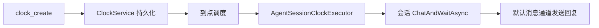

# 定时任务

`ClockService` 是宿主拥有的共享调度器；`Cron` 只是 Agent 会话上的工具门面。任务持久化在 core 的 `clock` scope，每项任务仍严格归属于创建它的会话。

## 模型可用工具

| 工具 | 用途 |
| --- | --- |
| `clock_create` | 创建任务 |
| `clock_list` / `clock_get` | 查看当前会话的任务 |
| `clock_update` / `clock_delete` | 修改、启停或删除任务 |
| `clock_log` | 查询执行记录 |

cron 使用 Linux 五字段格式：`分 时 日 月 周`，例如 `0 9 * * 1-5`。支持 `@daily` 等别名；默认时区为 `Asia/Shanghai`，默认超时 600 秒，范围为 1–86400 秒。`run_once=true` 只执行下一次匹配。

## 执行路径

任务内容作为一条会话消息交给 Agent，因此会与该群的普通消息串行处理，并使用创建时对应的模型、工具和消息通道。任务只能由所属会话查询、修改或删除；执行日志保留任务 ID、计划时间、状态、耗时和结果摘要。

## 调度语义

- 任务在进程重启后从存储恢复；中断的运行记录会恢复为可追踪状态。
- 停机期间错过的时间点记录为 `skipped/misfire`，不会补跑；运行中的同一任务再次到点记录为 `skipped/overlap`。
- 单次任务执行后自动禁用；失败、超时、取消和跳过均写入日志。
- 关闭时调度器停止接收新任务，并最多等待正在运行的任务收敛 5 秒。

## 相关页面

- [会话层](session.html) — 会话队列与 `ChatAndWaitAsync`
- [Tool Design](tool-design.html) — 工具调用与异步任务回调
- [核心宿主](../architecture/core.html) — 调度器的创建与关闭
