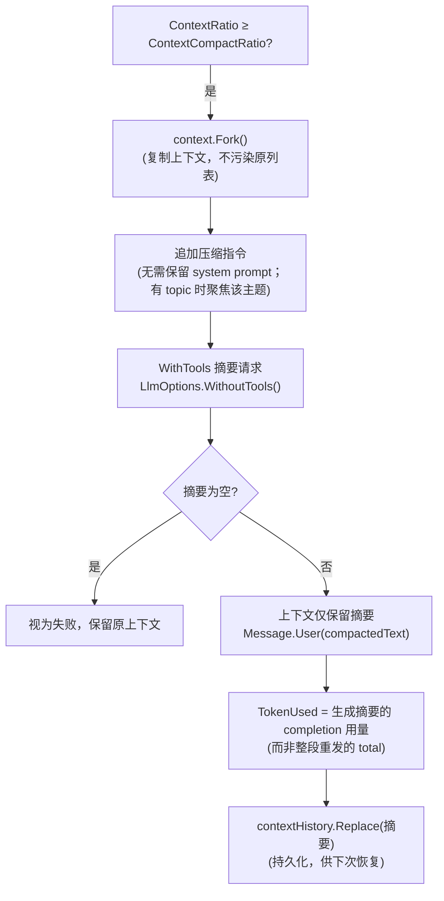

# 缓存友好压缩（Cache-Friendly Compaction）

**缓存友好压缩**是 MerryBot 上下文压缩（Context Compaction）的实现方式：把长对话**压缩为一段摘要并保留在上下文中**，形成稳定的上下文前缀——后续请求可**复用 Provider 的 prompt cache**（如 Anthropic `cache_control` 断点、OpenAI 自动缓存），在控制上下文占用的同时减少重复计费、加速响应。

```
长对话历史（多轮 user/assistant/tool）
        │  Compact：用 LLM 生成一段摘要（WithoutTools 纯文本请求）
        ▼
摘要（保留为 user 消息，TokenUsed 重置）──► 后续请求的稳定前缀
        │
        ▼
Provider prompt cache 命中（cachedUsage 统计）──► 更快、更省
```

## 为什么需要压缩

- **模型上下文有限，避免Context Rot**：长对话（尤其工具多轮）会使上下文不断增长。上下文越长，费用越高，在逼近 `TokenLimit`时，模型性能会显著下降。
- **会话回收占用**：由于空间局部性原理，过了一段时间，一般而言用户不再会追问之前的上下文。一是上下文长造成费用高（缓存已经失效了），二是避免之前的上下文影响接下来的对话。

## 触发时机（三条路径）

| 触发点       | 位置                           | 说明                                                                                |
| ------------ | ------------------------------ | ----------------------------------------------------------------------------------- |
| 对话结束评估 | `Agent.Chat()` 循环结束后      | `ContextRatio >= ContextCompactRatio`（默认 0.7）时压缩，为下一条用户消息腾出上下文 |
| 会话回收前   | `AgentSessionManager` 空闲清理 | 清理前先 `CompactAsync`，摘要持久化，下次恢复从摘要快照开始                         |
| 手动触发     | `CompactAsync(ct, topic)`      | TUI `/compact` 与群聊命令；`topic` 指定时围绕该主题压缩                             |

## 压缩流程



关键点：

- **`context.Fork()` 后压缩**：不直接改动原上下文；`SystemPrompt` 单独传参，不参与压缩
- **`WithoutTools()` 摘要请求**：禁用工具，避免模型返回 tool_calls 而摘要为空；同时不产生额外工具执行消耗
- **空摘要视为失败**：保留原上下文不动
- **摘要作为 user 消息保留**：压缩后上下文只有一条摘要消息，而不是清空——这是**缓存友好**的核心（见下）

## 缓存友好设计


**稳定前缀 → 命中 prompt cache**

压缩后的上下文仅含摘要消息，作为后续请求的**稳定前缀**；`AnthropicBackend` 在启用 `enablePromptCache` 时给最后一条消息打 `cache_control: { "type": "ephemeral" }` 断点，prompt 前缀稳定即可命中缓存、复用已缓存的部分，`TokenUsage.cachedUsage`（Anthropic `cache_read_input_tokens`）统计命中量。

**摘要持久化复用**

压缩成功后 `contextHistory.Replace(摘要)`：会话回收后再恢复时，直接加载摘要快照（而非整段历史），恢复成本与下次请求的输入都更小。

> 注意：`TokenUsed` 重置未计入 system prompt 的 tokens，压缩后比例可能略低于真实占用；下一次 `Chat` 循环会以最后一次请求的输入+输出用量覆盖校正。

## 与回收 / 恢复的闭环

```
对话增长 → 超阈值触发缓存友好压缩（摘要保留 + 持久化）
    → 会话空闲 → 回收前再次压缩（摘要已是最新）
    → 会话被移除（GC）
    → 再次访问 → GetSessionAsync 走 create 回调 → 从摘要快照恢复
```

压缩失败（如 LLM 不可用）不阻塞回收：历史已逐轮 `Append` 落库，移除引用不丢数据，下次恢复从完整历史重建。

## 相关页面

- [Agentic Loop](agentic-loop.html) — 压缩在对话循环中的触发与"循环内不压缩"决策
- [会话层](session.html) — 回收前压缩与摘要持久化恢复
- [LLM 请求](llm-request.html) — prompt caching 与 `TokenUsage.cachedUsage`
- [事件流](events.html) — `ContextCompaction` 事件（started/completed/failed）
