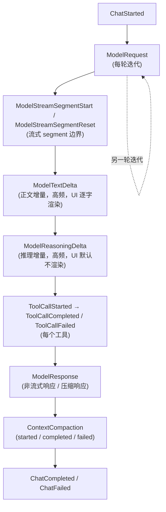

# 事件流（`AgentLogEvent`）

`AgentLogEvent`（`Agent/AgentLogEvent.cs`）是 Agent 对外发布的 **best-effort 诊断事件**：经 `AgentOptions.OnLog` 回调发布，回调抛出的异常会被忽略——可观测性绝不干扰对话主流程。

## 完整生命周期



## 事件类型（`AgentLogEventKind`）

| 事件 | 触发时机 | 说明 |
| --- | --- | --- |
| `ChatStarted` | 一次 `Chat()` 开始 | 对话级事件 |
| `ChatCompleted` / `ChatFailed` | 对话结束 / 异常 | 携带最终结果或异常 |
| `ModelRequest` | 每轮迭代请求 LLM | 迭代从 1 起 |
| `ModelResponse` | 非流式响应 / 压缩响应返回 | 携带结果与用量 |
| `ModelTextDelta` | 流式正文增量 | **高频**事件，UI 逐字渲染 |
| `ModelReasoningDelta` | 流式推理增量 | **高频**事件，UI 默认不渲染 |
| `ModelStreamSegmentStart` | 一个流式 segment 开始 | Result 为 attempt 序号；segment 边界由 Agent 解释（ModelRequest 之后或 Reset 之后的增量属于新 segment） |
| `ModelStreamSegmentReset` | 当前 segment 作废 | Client 将重建流重试，Exception 携带失败原因；UI 应丢弃该 segment 已渲染的全部增量 |
| `ContextCompaction` | 上下文压缩 | started / completed / failed 三态 |
| `ToolCallStarted` | 工具开始执行 | 携带工具名 / 调用 ID / 参数 |
| `ToolCallCompleted` | 工具执行成功 | 携带截断后的结果 |
| `ToolCallFailed` | 工具执行失败 / 未注册 | 携带异常或错误信息 |

## 事件载体

```csharp
public sealed record AgentLogEvent(
    AgentLogEventKind Kind,
    DateTimeOffset TimestampUtc,
    int Iteration = 0,          // 模型/工具事件从 1 起，对话级事件为 0
    string? ToolName = null,
    string? ToolCallId = null,
    string? Arguments = null,
    string? Result = null,
    TokenUsage? Usage = null,
    Exception? Exception = null);
```

## 消费方式

- **发布**：`Agent.Log()` 内部调用 `options.OnLog?.Invoke(logEvent)`，异常被吞掉
- **在 MerryBot 中**：经 `plugins/Agent.LogBridge.cs` 桥接到插件 Logger，汇入[统一日志体系](../architecture/core.html)（NLog，layout 含 `|LEVEL|` 段）
- **在 TUI 中**：直接消费事件流做界面渲染（`ModelTextDelta` 逐字显示、`ModelStreamSegmentReset` 丢弃作废段）

## 相关页面

- [Agentic Loop](agentic-loop.html) — 事件产生的循环主体
- [LLM 请求](llm-request.html) — 流式 reset 与 segment 语义
- [Tool Design](tool-design.html) — 工具相关事件
- [框架核心](../architecture/core.html) — 统一日志体系
