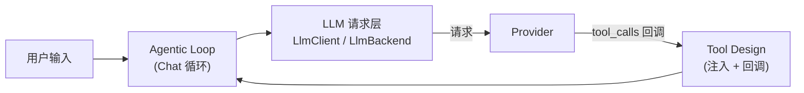
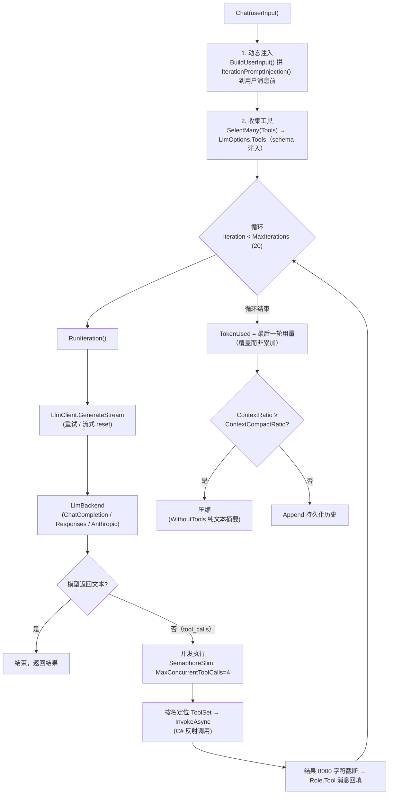

# Agent 架构

Agent 是 MerryBot 的 **LLM Agent 引擎**，不依赖 NapCat/QQ，可独立复用（`Agent.Tui` 即单独打包复用）。它由三个核心模块组成：

| 模块 | 文档 | 核心代码 |
| --- | --- | --- |
| LLM 请求 | [LLM 请求](llm-request.html) | `LlmClient/Client.cs`（重试层）、`LlmBackend/`（协议适配） |
| Tool Design | [Tool Design](tool-design.html) | `Agent/Agent.ToolSet.cs`（工具抽象）、`Agent/Agent.RunIteration.cs`（同步回调）、`Agent.Session/TerminalToolSet.cs`（异步完成回调） |
| Agentic Loop | [Agentic Loop](agentic-loop.html) | `Agent/Agent.cs`（Chat 循环）、`Agent/Context*.cs`（上下文） |
| 定时任务 | [定时任务](clock.html) | `Agent.Session/ClockService.cs`、`Cron.cs` |
| 能力管理 | [能力管理](capabilities.html) | Skills、记忆、视觉、消息和 Shell 工具 |

## 一次对话的完整数据流

## 与框架核心的关系

- Agent 引擎本身是**通用库**（`Agent/`、`Agent.Session/`、`Agent.Tools/`、`LlmClient/`、`LlmBackend/` 均为独立项目），不引用 NapCat
- 在 MerryBot 中，`AgentPlugin` 作为普通插件接收群消息；`AgentServicePlugin` 向 Agent 与 WebUI 提供 Skills、记忆和上下文快照服务
- 定时任务调度器（cron）由宿主 `ClockService` 拥有，Agent 只注册执行器
- LLM Provider / Key 由 `LlmProviderPlugin` 维护，Agent 通过 `Client`/`Backend` 发起请求
- 对话消息经 `ai_messages` 集合审计（见[存储](../architecture/storage.html)）

## 相关页面

- [LLM 请求](llm-request.html) — 重试与协议适配
- [Tool Design](tool-design.html) — 工具注入与回调
- [Agentic Loop](agentic-loop.html) — 对话循环与上下文
- [会话层](session.html) — Agent 创建、会话恢复与自动回收
- [缓存友好压缩](compaction.html) — 上下文压缩与 cache 复用
- [事件流](events.html) — AgentLogEvent 诊断事件
- [定时任务](clock.html) — cron 调度、执行与会话隔离
- [能力管理](capabilities.html) — Skills、记忆、视觉、消息和 Shell
