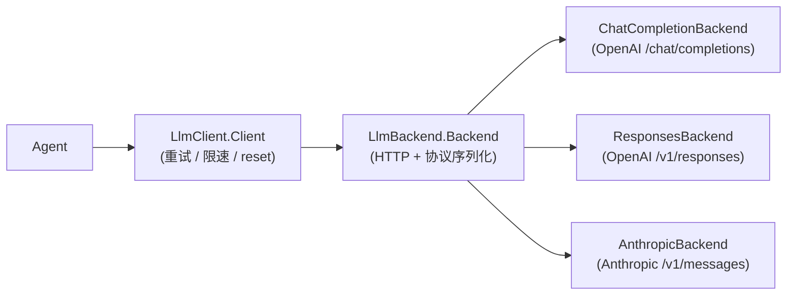

# LLM 请求

LLM 请求被严格分层为**重试层**（`LlmClient`）与**协议适配层**（`LlmBackend`），上层（Agentic Loop）只依赖 `Client`，不感知任何 Provider 协议细节。



## 协议适配层（`LlmBackend`）

### Backend 接口

```csharp
public interface Backend
{
    Task<(GenerateResponse, TokenUsage)> Generate(...);       // 非流式
    Task GenerateStream(IStreamSink sink, ...);               // 流式（推送式）
}
```

**流式采用推送式回调**（`IStreamSink`）：

- `OnTextDelta(delta)`：正文增量（逐 token 拼接即完整正文）
- `OnReasoningDelta(delta)`：推理增量（OpenAI `reasoning_content` / Anthropic thinking 文字）
- `OnCompleted(response, usage)`：流正常结束，携带**全量** `GenerateResponse`（正文/推理/工具调用/thinking 块）

契约：`OnCompleted` 之后不再有任何回调；回调抛出的 `LlmException`（如重试层检出正文标记）穿透后端读循环向上传播，后端不得包装。

### 核心数据模型（`Backend.cs`）

| 类型 | 说明 |
| --- | --- |
| `LlmOptions` | Model/Temperature/MaxTokens/**Tools**/ExtraBody/ReasoningEffort/两段超时；`WithoutTools()` 返回禁用工具的副本（压缩任务用） |
| `GenerateResponse` | Content / ToolCalls / ReasoningContent / **ThinkingBlocks**（Anthropic 思考块，含签名，多轮必须原样回传） |
| `ToolCall` | Id / Name / Arguments（JSON 字符串） |
| `Message` | role（User/Assistant/System/Tool）+ content parts（文本/图片）+ toolCallId + toolCalls + thinkingBlocks |
| `TokenUsage` | total/prompt/completion/cached，支持 `+` 累加 |
| `LlmModelCapabilities` | 模型能力位标记（Text/ImageInput/ToolCalls/Reasoning/…） |

### 三种后端实现

| 后端 | 协议 | 要点 |
| --- | --- | --- |
| `ChatCompletionBackend` | OpenAI 兼容 `/chat/completions` | `BuildRequestBody` 构造请求体（tools/reasoning_effort/stream_options.include_usage）；SSE `ParseChunk` 按块解析；工具调用分片按 index 累积 |
| `ResponsesBackend` | OpenAI `/v1/responses` | input / function_call_output / instructions 语义 |
| `AnthropicBackend` | `/v1/messages` | `x-api-key` 头、system 顶层字段、`tool_use`/`tool_result` 块、thinking 块（**签名回放**：深度思考开启后必须回传）、prompt caching 断点 |

### 错误映射

- `Errors.cs`：`LlmException` 层次——**可重试**（RateLimit / ServerError / Network）、**不可重试**（Authentication / ModelNotFound / InvalidRequest / RequestTimeout / InvalidResponse）、特殊（`StrayToolCallMarkupException` 可重试、`ContextLengthExceeded` 需压缩后重试）
- `BackendErrors.cs`：HTTP 状态码 → `LlmException` 统一映射（`BackendErrors.Map`），context-length 关键词识别

### 两段超时（`LlmDefaults`）

| 超时 | 默认值 | 适用 |
| --- | --- | --- |
| TimeToFirstByte（首字节/TTFB） | 60s | **仅流式**：衡量服务端产出第一个 chunk 的延迟。非流式不设此段（服务端算完整轮才发响应头，TTFB 会误杀深度思考模型） |
| TotalGeneration | 非流式 5min / 流式 30min | 整个生成过程（含响应体读取） |

超时映射为**不可重试**的 `RequestTimeoutException`（LLM 请求非幂等，超时重试可能双倍计费）。

## 重试层（`LlmClient`）

### Client

`Client` 封装 `Backend` 并实现重试：

- **非流式**（`Generate`）：循环最多 `maxAttempt` 次，仅重试 Retryable 异常
- **流式**（`GenerateStream`）：基于 **reset 语义**重试（见下）
- **避让时间**（`GetDelay`）：优先 `RateLimitException.RetryAfter`，否则 `initialDelay × 2^(attempt-1)`（1L 移位防 int 溢出），两者都设 **30 秒上限**（防异常大的 Retry-After 长时间空等）
- **运行时切换后端**（`UpdateBackend`）：锁内替换引用，每次请求开始时读取快照，同一请求全程用同一后端；WebUI 改 Provider 无需重启
- 取消（`OperationCanceledException`）一律直接传播，不重试

### 流式 reset 语义

`IResettableStreamSink` 在 `IStreamSink` 之上增加 `OnReset(reason, cause)`：

- 任何**可重试失败**（含中途断流、正文检出工具调用标记）在预算内都会回调 `OnReset` 后**重建流**——此前推送的全部增量作废，消费者据此丢弃
- 不再受"首元素产出前才可重试"的限制
- 终态失败（不可重试/预算耗尽/用户取消）**不回调** `OnReset`，直接抛异常
- Client 不定义"段"（segment）：段的边界由消费者解释（调用开始或 OnReset 之后、到下一个 OnReset/OnCompleted 之前属于同一段）

```csharp
// 伪代码：流式重试骨架
for (attempt = 1; ; attempt++) {
    try {
        await CurrentBackend.GenerateStream(attemptSink, ...);
        return;
    } catch (LlmException e) when (e.Retryable && attempt < maxAttempt) {
        sink.OnReset(MapReason(e), e);   // 作废本段增量
        await Task.Delay(GetDelay(e, attempt)); // 避让后重建
    }
}
```

### 正文工具调用标记检测

- `StrayToolCallDetector`：在正文**开头/结尾 512 字符窗口**检测三种结构——DSML 特殊 token / XML 工具标签 / JSON 工具调用结构（仅携带工具的请求启用）
- 流式路径由 `MarkupGuardSink` 包装：增量即时透传（不扣留），完成时对全量正文检测，命中则抛 `StrayToolCallMarkupException` 走统一 reset 重试
- 非流式路径在 `Generate` 终检，命中额外重试一次（不消耗 maxAttempt 预算），重试后仍命中才抛出（兜底：不把标记文本当正常回复返回）

## 相关页面

- [Agentic Loop](agentic-loop.html) — 上层如何使用 Client
- [Tool Design](tool-design.html) — tools schema 如何产生
- [框架核心](../architecture/index.html) — 统一日志与 Provider 存储
