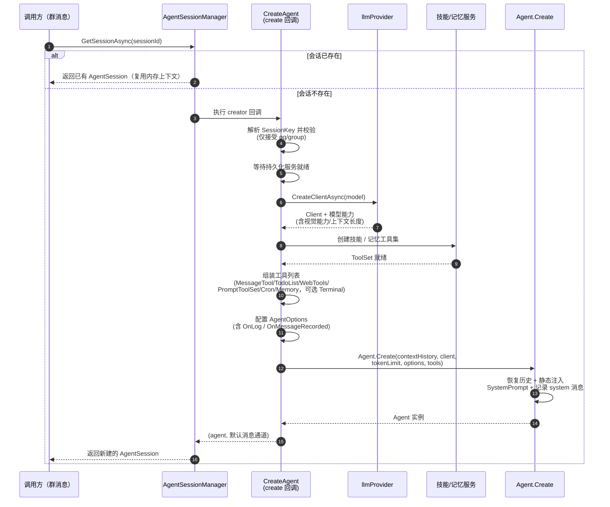
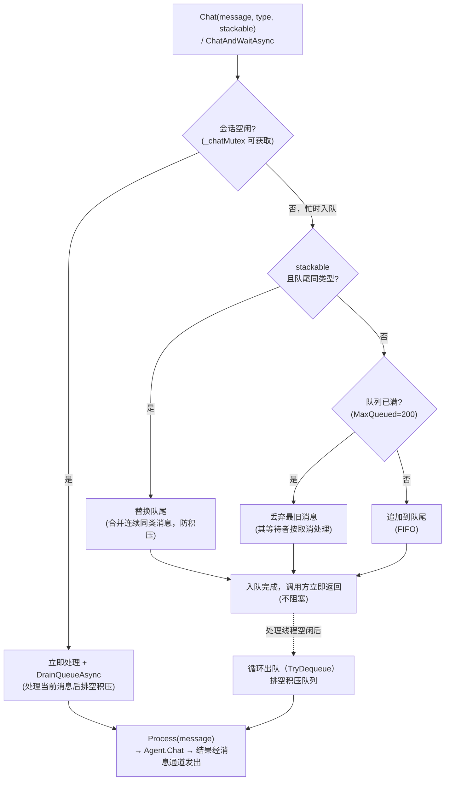
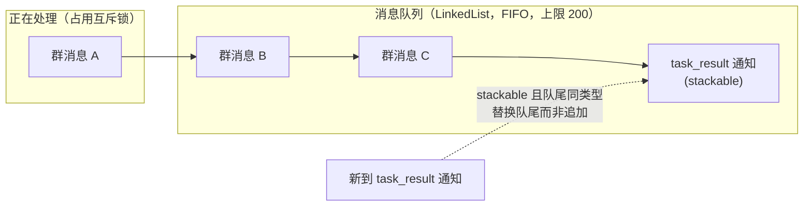

# 会话层（Session）

会话层把「消息队列」与「Agent 实例」绑定在一起：每个会话对应一个 `AgentSession`（串行消息队列）+ 底层一个 `Agent`，由 `AgentSessionManager`（会话注册表）统一管理创建、恢复与回收。代码位于 `Agent.Session/` 与 `plugins/Agent.cs`、`plugins/Agent.Create.cs`。

```
AgentSessionManager（注册表 + 空闲回收）
  └─ AgentSession（串行消息队列，MaxQueued=200）
       └─ Agent（对话引擎：LLM 请求 / 工具 / 上下文）
```

## Agent 创建（create 回调）

`AgentSessionManager` 通过**工厂回调（creator）**创建会话：`GetSessionAsync(sessionId)` 时若会话不存在，调用 `AgentPlugin.CreateAgent`（`plugins/Agent.Create.cs`）异步构建，并缓存复用。核心阶段如下：



各阶段要点：

| 阶段 | 说明 |
| --- | --- |
| 会话键校验 | `SessionKey.Parse`，仅接受 `qq/group` 平台会话 |
| 等待持久化服务 | `persistenceStartTask`：技能 / 记忆等持久化服务初始化完成后才创建 Agent |
| 主 LLM 客户端 | `llmProvider.CreateClientAsync(agentConfig.LlmModel)`，解析模型能力（`LlmModelCapabilities`） |
| 辅助视觉模型 | 主模型无视觉能力时启用，多个模型逐层降级；`VisionRouter` 统一路由 |
| 技能 / 记忆工具集 | `SkillToolSet`（文件技能）、`MemoryToolSet`（懒创建空 index + 注入记忆上下文） |
| 工具列表 | MessageTool / TodoListToolSet / WebTools / PromptToolSet / Cron / MemoryToolSet；`AllowShell` 开启时才注册 `TerminalToolSet` |
| AgentOptions | SystemPrompt / MaxOutputTokens / MaxIterations / MaxConcurrentToolCalls / ContextCompactRatio / ReasoningEffort / OnMessageRecorded（审计）/ OnLog（事件桥接） |
| Agent.Create | 见下方「会话恢复」；子任务工具集 `SubAgentToolSet` 最后加入（复用同一模型与工具列表，不允许嵌套派生） |

**create 回调的关键行为**：

- **并发共享**：同一会话的并发调用共享同一个创建任务（`Lazy` + `ExecutionAndPublication`），只创建一次
- **失败可重试**：初始化抛异常时移除缓存条目，下次调用重新走 creator
- **`@机器人 /new` → 重建**：`RebuildSessionAsync` 移除会话并**重新执行 create 回调**——重建 LLM 客户端与工具集（配置/技能变化即时生效），配合 `ResetAsync` 从空历史开始

## 会话恢复

会话恢复发生在两条路径上：

**① 内存级恢复（`GetSessionAsync`）**：会话在注册表中已存在则直接复用（含内存中的 `Context.Messages` 与 `TokenUsed`）；不存在才走 create 回调。

**② 历史级恢复（`ContextManager.Create`）**：`Agent.Create` 时从持久化历史恢复对话上下文：

```csharp
// ContextManager.Create
Context context = contextHistory == null
    ? new([])                        // 不持久化：从空上下文开始
    : new(await contextHistory.Restore()); // 从历史恢复消息列表
```

- `ContextHistory` 接口（`Agent/ContextHistory.cs`）：`Restore` / `Append` / `Replace` / `Clear`
- 实现 `DatabaseContextHistory`（`plugins/Agent.ContextHistory.cs`）：存储于 `agent` scope 的 LiteDB 集合，按 `sessionId` 隔离
- 每次对话结束将消息 `Append` 落库（未压缩时）；**压缩时用摘要 `Replace`** 历史
- `contextHistory == null` 时 Agent 纯内存运行（`Agent.Tui` 等场景）

> 恢复的粒度：**会话被回收后再访问**，内存上下文丢失，但历史已落库（含压缩摘要），下次创建从历史/摘要恢复——回收与恢复是一对，见下节。

## 自动回收

`AgentSessionManager` 启动后台监控循环（`CleanupLoop`，每 1 小时扫描一次），回收长时间空闲的会话：

```
CleanupLoop（每 1 小时）
  └─ 遍历会话：
       ├─ 跳过未完成创建 / 正在处理消息（IsBusy）的会话
       ├─ 跳过未超过空闲阈值（默认 12 小时，IdleSessionTimeoutHours 可配）的会话
       ├─ 清理前先 CompactAsync 压缩（[缓存友好压缩](compaction.html)）
       │    └─ 压缩失败（LLM 不可用）记日志仍继续清理——历史已逐轮落库，移除引用不丢数据
       ├─ 压缩期间可能有新消息入队：再确认一次仍空闲才移除
       └─ 移除会话引用（交由 GC）
```

回收前压缩把长对话变成**持久化的摘要快照**，下次恢复从摘要开始、占用更小；压缩的具体机制（Fork、`WithoutTools` 摘要请求、TokenUsed 重置、cache 复用）见[缓存友好压缩](compaction.html)。

## 会话队列与消息投递

`AgentSession` 用串行队列（`SemaphoreSlim(1,1)`）保证同一会话的消息按顺序处理。排队规则：



队列实际形态与合并效果：



规则说明：

- `Chat(message, type, stackable)`：不阻塞调用方，忙时入队；`stackable=true` 且队尾同类型时**替换队尾**（合并连续同类消息，防积压）
- `ChatAndWaitAsync`：等待真正执行完成并返回结果与用量（供定时任务执行器使用）；内部使用保留类型 `"wait"`，**不可被 stackable 同类消息替换队尾**
- 每个队列元素携带**自己的** `CancellationToken`、消息通道与可选完成通知（`TaskCompletionSource`），取消/完成按各自语义处理
- 队列上限 `MaxQueued=200`：超出丢弃最旧消息，保证最新消息不被阻塞
- 异步任务完成 / 子任务结果以 `type: "task_result"` / `"subagent_result"` 的 stackable 消息注入队列，主模型下一轮处理（见 [Tool Design](tool-design.html) 的异步完成回调）

## 相关页面

- [Agentic Loop](agentic-loop.html) — Agent 对话循环与上下文压缩
- [缓存友好压缩](compaction.html) — 上下文压缩与 cache 复用
- [Tool Design](tool-design.html) — 异步任务完成回调（通知主模型）
- [事件流](events.html) — 会话/工具运行事件
- [框架核心](../architecture/core.html) — 宿主时钟服务与统一日志
- [存储](../architecture/storage.html) — agent scope 历史持久化
