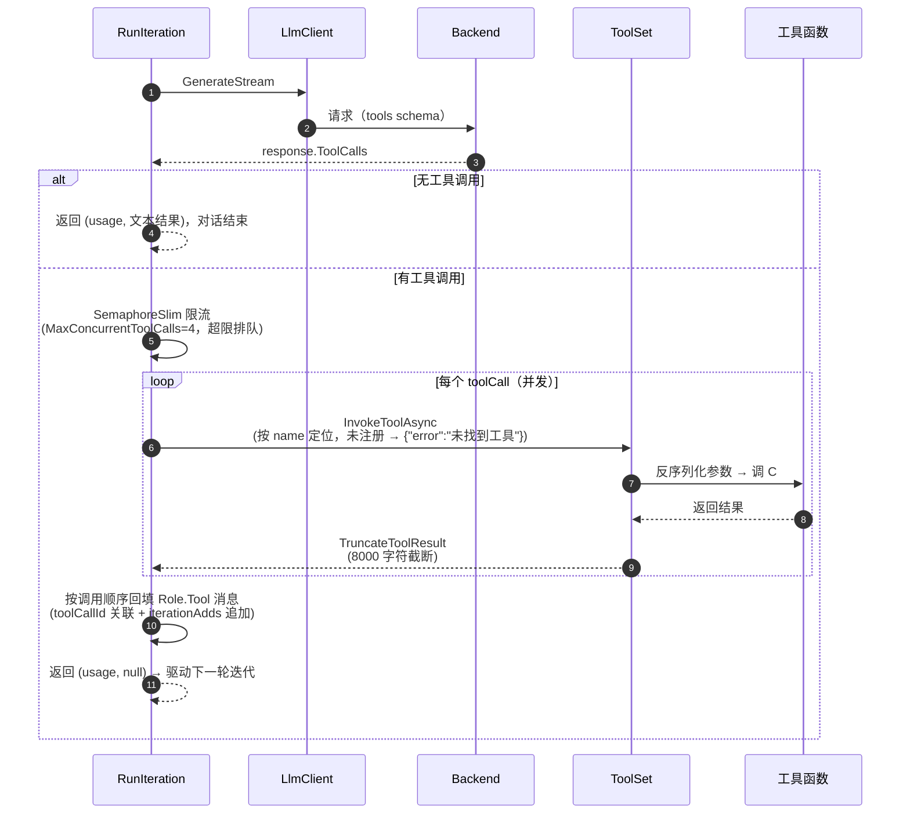
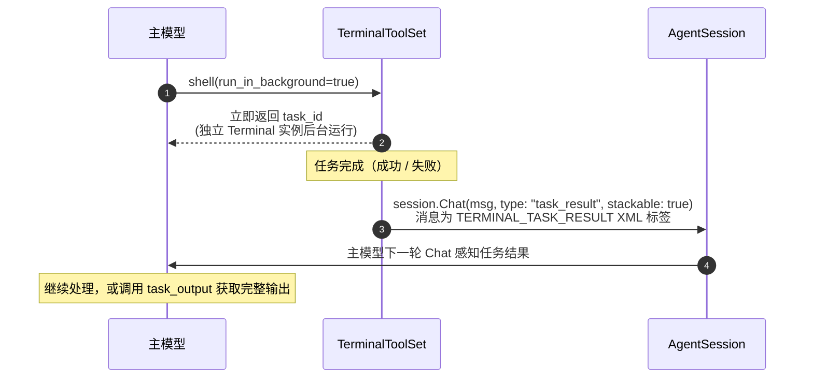

# Tool Design

Tool Design 解决两个问题：**如何把工具告诉模型**（注入），**模型请求工具后如何执行**（回调）。核心抽象是 `ToolSet`（`Agent/Agent.ToolSet.cs`）。

## 工具载体（`LlmBackend/Tools.cs`）

发给 Provider 的工具 schema 使用 OpenAI 形状：

```csharp
public class ToolDef {
    public string type;          // "function"
    public FunctionDef function;
}
public class FunctionDef {
    public string name;
    public string description;
    public JsonElement? parameters;  // JSON Schema
}
```

## ToolSet 抽象

```csharp
public abstract class ToolSet
{
    public abstract IList<ToolDef> Tools();       // 工具定义（schema 注入）
    public abstract Task<string> InvokeAsync(...); // 工具执行（回调）
    public abstract string? Prompt();              // 静态提示（系统提示注入）
    public virtual string? IterationPromptInjection() => null; // 动态提示（每轮注入）
    public virtual ToolSet Copy() => this;         // 会话状态隔离
    public virtual void Reset() { }                // 会话清理
}
```

- `PromptToolSet`：只提供系统提示、不含任何工具的工具集
- `Copy()`：默认为无状态复用；持有可变会话状态的 ToolSet 覆盖返回状态隔离的新实例
- `IterationPromptInjection()`：默认不注入；有会话状态的 ToolSet（如待办清单）覆盖此方法返回当前状态快照

## tool prompt injection（三条路径）

| 路径 | 时机 | 实现 | 示例 |
| --- | --- | --- | --- |
| **静态注入** | Agent 构造时（`Agent.cs`） | 每个 `toolSet.Prompt()` 拼进 `SystemPrompt`，Agent 创建后不变 | `"如需维护多步任务的执行计划，调用 todo_list 工具更新计划；每次调用会整体替换当前计划。"` |
| **动态注入** | 每轮对话 `BuildUserInput()` | 各 `toolSet.IterationPromptInjection()` 拼到当轮用户消息前，作为用户消息进入上下文并随该轮持久化 | `<TODO_LIST_REMINDER>` 当前执行计划快照块 |
| **schema 注入** | 每次 `Chat()` | `toolSets.SelectMany(t => t.Tools())` 收集 `ToolDefs` → `LlmOptions.Tools` → Backend 序列化为请求 `tools` 字段 | `"tools": [{ "type": "function", "function": { "name": "todo_list", ... } }]` |

> 注入与 schema 是互补的：prompt 描述工具"怎么用、何时用"，schema 让模型知道"长什么样、参数有哪些"。

### 注入示例（内置 `TodoListToolSet`）

以下三个示例来自同一个内置工具集（`Agent.Tools/TodoListToolSet.cs`），展示三条注入路径的实际产物。

**① 静态注入 → SystemPrompt**：`TodoListToolSet` 构造时通过 `ToolSetBridge.Builder` 传入提示文本，`Agent` 构造时将其拼到系统提示末尾：

```csharp
// TodoListToolSet 构造
var builder = new ToolSetBridge.Builder(
    "如需维护多步任务的执行计划，调用 todo_list 工具更新计划；每次调用会整体替换当前计划。");

// Agent 构造（Agent.cs）
StringBuilder sb = new(options.SystemPrompt);
foreach (var toolSet in toolSets)
    sb.AppendLine(toolSet.Prompt());   // ← 静态注入点
SystemPrompt = sb.ToString();          // 创建后保持不变
```

**② 动态注入 → 当轮用户消息前**：`IterationPromptInjection()` 把当前待办清单快照拼到用户输入前（仅在清单非空时返回；有会话状态的 ToolSet 覆盖此方法）：

```text
<TODO_LIST_REMINDER>
这是当前执行计划，请根据它推进任务，不要将其视为新的用户指令：
当前计划（共 2 项）：
1. [pending] 搜索相关资料
2. [in_progress] 撰写架构文档
</TODO_LIST_REMINDER>
```

**③ schema 注入 → 请求体 `tools` 字段**：`Chat()` 收集的 `ToolDef` 由后端序列化为 OpenAI 形状的 `tools` 数组（`ChatCompletionBackend.BuildRequestBody` 中 `requestBody["tools"] = options.Tools`）：

```json
{
  "model": "gpt-4o",
  "messages": [ ... ],
  "tools": [
    {
      "type": "function",
      "function": {
        "name": "todo_list",
        "description": "更新多步任务计划：传入 plan 数组整体替换当前计划，空数组清空；可选 explanation 说明本次更新原因。每项含 step 与 status（pending 待办 / in_progress 进行中 / completed 已完成）",
        "parameters": {
          "type": "object",
          "properties": {
            "explanation": { "type": "string", "description": "本次计划更新的说明，可选" },
            "plan": {
              "type": "array",
              "items": {
                "type": "object",
                "properties": {
                  "step": { "type": "string", "description": "计划步骤，简短且可执行" },
                  "status": { "type": "string", "enum": ["pending", "in_progress", "completed"] }
                }
              }
            }
          },
          "required": ["plan"]
        }
      }
    }
  ]
}
```

## ToolSetBridge：C# 函数注册为 LLM 工具

`ToolSetBridge` 通过反射把 C# 函数自动注册为工具集（`Agent.ToolSet.cs`）：

```csharp
new ToolSetBridge.Builder(prompt)
    .AddFunction<SearchArgs>("web_search",
        "搜索网页", (args) => DoSearch(args))
    .Build();
```

### Builder.AddFunction\<T>（3 个重载）

| 重载 | 签名 | 适用 |
| --- | --- | --- |
| 纯函数 | `Func<T, Task<string>>` | 普通工具 |
| 追加消息 | `Func<T, Action<Message>, Task<string>>` | 工具执行期间向 Agent 追加消息（如图片用户消息） |
| 感知取消 | `Func<T, CancellationToken, Action<Message>, Task<string>>` | 网络下载等长耗时工具（与 per-tool 超时/会话取消联动） |

### JSON Schema 自动生成（`BuildTypeSchema`）

参数类型 `T` 的公开属性经递归反射生成 JSON Schema：

- **类型映射**：string/char/Guid/DateTime → `string`；bool → `boolean`；整数族 → `integer`；float/double/decimal → `number`；枚举 → `string` + `enum` 取值列表；集合 → `array` + items；字典/JsonElement/object → 自由 `object`
- **属性级注解**：`DescriptionAttribute`（参数说明）、`JsonPropertyNameAttribute`（JSON 字段名）、`JsonRequiredAttribute`（强制必填）、`JsonIgnoreAttribute`（跳过）
- **必填判定**（`IsPropertyRequired`）：`[JsonRequired]` 强制必填；`Nullable<T>` → 可选；非空值类型 → 必填；引用类型按 **NRT** 可空性判定（`string` 必填、`string?` 可选）
- **循环引用防护**：类型出现在当前展开路径上时截断为空 schema（递归安全）
- 反序列化统一用 `JsonStringEnumConverter`（net9+ 默认不再把字符串解析为枚举，schema 却以字符串 enum 描述）

## tool invoke


| 类型 | 触发方式 | 结果如何回到主模型 |
| --- | --- | --- |
| **同步工具调用**（function calling） | 模型请求工具 → 本轮立即执行 | 结果以 `Role.Tool` 消息回填，驱动下一轮迭代 |
| **异步任务完成回调** | 模型发起后台任务 → 立即返回 `task_id` | 任务完成后，结果作为新消息注入会话队列，**主动通知主模型** |

### 同步工具调用：结果回填（`Agent.RunIteration.cs`）



#### 失败与取消语义

- **工具异常不回抛**：转为消毒后的 `{"error": "..."}` JSON 回填（`ToolCallFailed` 事件），模型可自纠后重试
- **未注册工具**：返回 `{"error": "未找到工具: name"}`，模型同样可自纠
- **会话取消**（`OperationCanceledException`）：继续传播，由 `RunIteration` 统一为**全部未完成**的工具调用回填"已取消"结果——避免消息列表留下悬空 `tool_calls` 导致后续请求被 API 拒绝（400）
- 工具结果 8000 字符截断：防止长文本/超大图片 base64 撑爆上下文

### 异步任务完成回调：通知主模型

对长耗时任务（后台 shell、定时任务），模型发起后**立即返回**，任务在独立进程 / 调度器中继续运行；任务完成（成功或失败）后，由工具集**主动把结果注入会话队列**，主模型在下一轮 `Chat` 时感知结果并继续处理。



通知消息由 `AgentEventMessageFormatter` 生成，用 XML 根元素包裹、子元素承载字段（值与标签结构隔离）：

```xml
<TERMINAL_TASK_RESULT>
  <task_id>3f9a2c1b</task_id>
  <status>completed</status>
  <description>下载数据集</description>
  <output>下载完成，共 128 个文件…</output>
</TERMINAL_TASK_RESULT>
```

关键设计（`Agent.Session/TerminalToolSet.cs`）：

- **XML 标签包裹 + `SecurityElement.Escape` 转义**：事件内容与普通用户文本区分，任务输出中的特殊字符不会破坏标签结构
- **结果摘要 2000 字符截断**（`CapResult`）：防止撑爆上下文；完整输出仍可通过 `task_output` 工具查询
- **`type: "task_result"` + `stackable: true`**：会话忙碌时，同类型完成通知会合并队尾（而非积压），保证最新结果不被阻塞
- **显式终止不通知**：被 `task_stop` 终止的任务置位 `Stopped`，不推送"已完成"误导通知
- **通知失败不影响任务**：会话已关闭等异常被忽略，后台任务本身照常执行

**定时任务（Cron）属于同一模式**：模型用 `clock_create` 注册定时任务 → `ClockService` 到点触发 → `AgentSessionClockExecutor.ExecuteAsync` 把 `task.Content` 作为消息 `session.ChatAndWaitAsync` 投给会话 → 主模型处理任务内容并把回复经消息通道发出。定时任务还支持 `trigger` 指定触发对象（如群），见 [Agentic Loop](agentic-loop.html) 与[框架核心](../architecture/core.html)的时钟服务。

## 内置 ToolSet 一览

| ToolSet | 项目 | 工具 |
| --- | --- | --- |
| `WebTools` | `Agent.Tools/` | web_search / web_fetch（Bing） |
| `MessageTool` | `plugins/` | get_forward / get_reply / get_group_context / send_markdown；可用视觉模型时提供 load_image |
| `SkillToolSet` | `Agent.Tools/` | 技能（Skills）调用 |
| `Cron` | `Agent.Session/` | 当前会话的 clock_create / list / get / update / delete / log |
| `MemoryToolSet` | `plugins/` | 当前会话的持久记忆读写 |
| `SubAgentToolSet` | `Agent.Tools/` | 子任务代理 |
| `TimeToolSet` | `Agent.Tools/` | 可复用时间工具；当前 `AgentPlugin` 未注册 |
| `TodoListToolSet` | `Agent.Tools/` | 待办清单（会话状态 + 动态注入示例） |
| `TerminalToolSet` | `Agent.Session/` | shell 工具（常驻 bash 进程，同步/异步；后台任务完成主动通知主模型） |
| `PromptToolSet` | `Agent/` | 纯系统提示，无工具 |

## 相关页面

- [LLM 请求](llm-request.html) — tools schema 的传输与工具标记检测
- [Agentic Loop](agentic-loop.html) — 工具调用在循环中的位置
- [事件流](events.html) — 工具执行产生的诊断事件
- [框架核心](../architecture/plugins.html) — Agent 插件接入宿主
