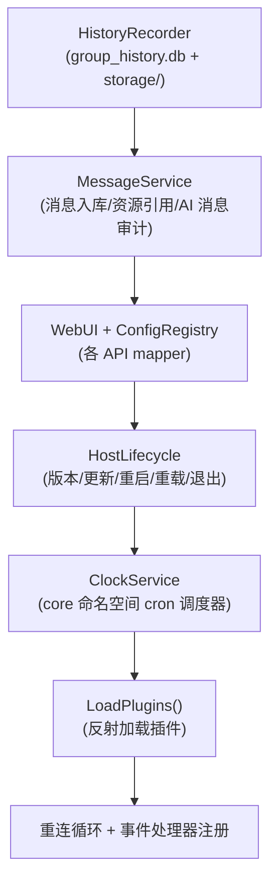
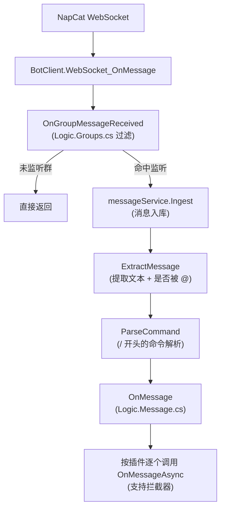

# 核心宿主

核心宿主是进程的骨架：负责启动、装配所有组件、连接 NapCat、分发消息、管理配置与生命周期。所有代码位于 `MerryBot/` 项目。

## 启动流程（`Entry.cs`）

`MerryBot/Entry.cs` 是顶层语句入口，按以下顺序执行：

1. **数据目录**：环境变量 `MERRY_BOT` 指定数据目录，未设置时默认 `data`（工作目录下）。日志目录 `<data>/log`、插件数据库 `<data>/plugin_data.db`
2. **启动配置**：`StartupConfig.Load(dataPath)` 读取 `setting.toml`（WebUI 监听地址等启动必需项），文件不存在时生成带注释的模板
3. **插件数据库**：`new PluginStorageDatabase(dbPath)` → `MigrateAsync()`（幂等 schema 迁移）→ `ConfigManager.Initialize(pluginDb)`（加载核心配置）
4. **日志初始化**：NLog 彩色控制台 + 文件双目标（见下文「统一日志」）
5. **构造客户端与宿主**：`new BotClient(config.NapcatServer, config.NapcatToken, logger, dataPath)` 与 `new Logic(botClient, pluginDb)`。**构造不再同步等待 NapCat 登录信息**——NapCat 未启动也能正常启动进程，连接由重连循环负责
6. **等待退出信号**：`Console.CancelKeyPress` 捕获 Ctrl+C → `cts.Cancel()` → `WaitForShutdownAsync` 返回 → `logic.Shutdown()`（幂等，只执行一次）

## 宿主装配（`Logic`）

`Logic` 构造时按固定顺序创建组件，顺序本身即依赖关系：

### 重连循环（`ReconnectLoopAsync`）

适配器自身不重连（库内自动重连已禁用），由宿主按 `ReconnectIntervalSeconds` 轮询：未连接时尝试 `Adapter.ConnectAsync`，成功/失败都记日志；`_hasEverConnected` 标记区分首次连接与断线重连，避免启动时输出假的 WARN。

### 后台任务

- `StartClockAsync()`：调度器初始化 + 启动，异常记日志不静默
- `RunWebUiAsync()`：WebUI `RunAsync()`，端口占用等异常记日志不导致进程退出

## 配置管理（`ConfigManager`）

- 核心配置类型为 `Config`（字段：`NapcatServer`、`NapcatToken`、`QqGroups`、`AuthorizedUser`、`MachineCode`、`ResourceSizeLimitMb`、`ReconnectIntervalSeconds`），详见[配置说明](../configuration/core.html)
- 存储于 `plugin_data.db` 的 `Plugin_Config_Table` 集合，键为 `core/config`（`prefix: "core"`）
- 首次启动生成默认配置落库；类型不匹配时仅使用内存默认值并告警
- 插件配置按插件 Id 隔离存储（见[存储](storage.html)与[插件子系统](plugins.html)）

## 时钟服务（`ClockService`）

- `ClockStore.cs` 内含 `internal CoreClockStore`：存储用 `PluginStorageDatabase.CreateScope("clock", prefix: "core")`，与插件数据隔离
- `Agent.Session/ClockService.cs` 是 core 拥有的 cron 调度器：Linux 五字段 cron、持久化、misfire 跳过、超时、会话隔离
- **调度器先于插件创建**，Agent 插件只注册执行器，生命周期归宿主

## 生命周期（`HostLifecycle`）

- 提供版本检测（git）、编译槽、重启、重载、退出能力
- `CommonLib` 定义 `ExitCode`：101/102/103 等，宿主按退出码决定是否重启
- `/update`、`/reload` 等高危操作在 WebUI 侧校验 `QQ == AuthorizedUser`（见 [WebUI 子系统](webui.html)）

## 消息处理链

群消息日志只保留 `群号|发送者|chain 长度` 摘要，避免完整消息链导致日志膨胀与隐私泄露。

## 插件加载（`PluginInitializer`）

- `Logic.Plugins.cs` 负责插件发现与加载（反射扫描 `plugins` 目录程序集）
- `PluginInitializer` 完成插件依赖注入与拓扑排序（`PluginInterop` 构造注入）
- 详见[插件子系统](plugins.html)

## 统一日志

项目约定所有日志走 `CommonLib.ISimpleLogger` 抽象：

- 宿主启动时 `SimpleLog.Default = new NLogAdapter("CommonLib")`，未显式注入 logger 的库（LlmClient/LlmBackend/HistoryRecorder/WebUI mapper 等）自动汇入 NLog
- **禁止**直连 `ConsoleLogger.Instance` 或裸 `Console.WriteLine/Error`
- NLog 文件目标按天命名 `bot-${shortdate}.log`，单日超 10MB 归档，保留 30 份
- layout 固定 `${longdate}|${level:uppercase=true}|${logger}|${message}`——WebUI 日志页的 `DetectLevel` 正则（`\b(TRACE|DEBUG|INFO|WARN|ERROR|FATAL)\b`）依赖 `|LEVEL|` 位置解析
- Trace 级别被 NLog rule 丢弃（高频诊断用）
- Agent 引擎事件经 `plugins/Agent.LogBridge.cs` 桥接到插件 Logger

## 关键文件

| 文件 | 职责 |
| --- | --- |
| `MerryBot/Entry.cs` | 顶层语句入口，启动流程 |
| `MerryBot/Logic.cs` | 宿主装配、重连循环、后台任务 |
| `MerryBot/Logic.Plugins.cs` / `Logic.Message.cs` / `Logic.Config.cs` | 插件加载、消息分发、配置读写 |
| `MerryBot/ConfigManager.cs` | 核心配置加载/保存 |
| `MerryBot/HostLifecycle.cs` | 版本/更新/重启/重载/退出 |
| `MerryBot/ClockStore.cs` | CoreClockStore（定时任务持久化） |
| `MerryBot/PluginInitializer.cs` | 插件 DI 与拓扑排序 |
| `MerryBot/MessageService.cs` | 消息持久化与资源引用 |
| `MerryBot/NLogAdapter.cs` | 统一日志适配 |

## 相关页面

- [存储](storage.html) — 插件数据库与历史记录
- [插件子系统](plugins.html) — 插件抽象与加载
- [WebUI 子系统](webui.html) — 历史后台与安全模型
