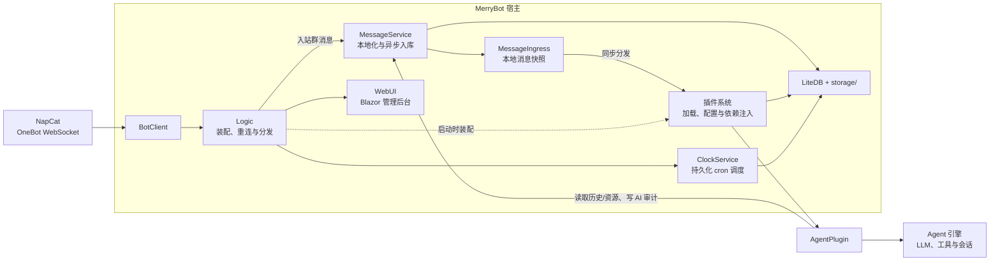

# 框架核心

框架核心指与 NapCat 连接、消息分发、插件装载、存储、WebUI 等**与 LLM Agent 无关**的宿主层。它提供了 Agent 运行所需的全部基础设施：消息如何进来、配置存哪里、日志怎么记、插件如何被加载。

## 模块划分

| 模块 | 文档 | 职责 |
| --- | --- | --- |
| 核心宿主 | [核心宿主](core.html) | 启动流程、组件装配（`Logic`）、配置管理、生命周期、消息处理链、统一日志 |
| 消息与 NapCat | [消息与 NapCat](messages.html) | OneBot 入站消息、消息链、本地资源引用与插件分发 |
| 存储 | [存储](storage.html) | 插件数据（`plugin_data.db`）与历史记录（`group_history.db` + 对象存储）两大存储体系 |
| 插件子系统 | [插件子系统](plugins.html) | `Plugin` 抽象、互操作接口、内置插件一览 |
| WebUI 子系统 | [WebUI 子系统](webui.html) | Blazor 历史后台、Minimal API、安全模型 |

## 启动装配

整个宿主只有一个入口（`MerryBot/Entry.cs`，顶层语句），核心装配逻辑在 `Logic`（`internal partial class`，拆分为 `Logic.cs` / `Logic.Plugins.cs` / `Logic.Message.cs` / `Logic.Config.cs` / `Logic.Event.cs` / `Logic.Groups.cs` 等文件）。装配顺序参见[核心宿主](core.html)。

## 与 Agent 架构的关系

- `AgentPlugin` 是接收群消息的普通插件；`AgentServicePlugin` 为 Agent 和 WebUI 提供 Skills、记忆和上下文快照服务。
- 宿主提供定时任务调度器，Agent 只注册执行器；调度器的会话边界见 [定时任务](../agent/clock.html)。
- `LlmProviderPlugin` 负责 Provider/Key 的存储与加密；Agent 通过 `LlmClient`/`LlmBackend` 发起请求。

## 相关页面

- [快速开始](../quickstart.html) — 安装与运行
- [配置说明](../configuration/index.html) — 核心配置与插件配置
- [Agent 架构](../agent/index.html) — LLM Agent 的内部设计
