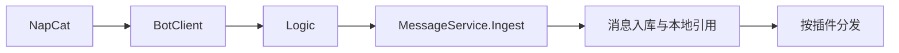

# 消息与 NapCat

`NapcatClient` 通过 WebSocket 接收 OneBot 事件。MerryBot 目前只把已配置群的群消息投递给插件；通知事件另经 `EventRegister` 分发。

## 入站处理

1. `BotClient` 收到群消息后触发 `OnGroupMessageReceived`。
2. `Logic` 先检查群号是否在核心配置 `QqGroups` 中；未监听的群直接忽略。
3. `MessageService.Ingest` 保存消息快照，提取图片、文件和合并转发的本地资源描述，并异步持久化。
4. `ExtractMessage` 识别 @ 机器人的 `AtData`；`ParseCommand` 仅解析以 `/` 开头的文本。
5. 宿主按加载顺序调用每个启用插件。某插件的拦截器返回 `true` 时，只跳过该插件本次处理。

插件收到的是克隆后的 `IReadOnlyList<TypedMessage>`，因此不应依赖对消息链的就地修改影响其他插件。

## 消息链

`TypedMessage` 是 OneBot 消息段的基类。常用类型包括 `TextData`、`AtData`、`ReplyData`、`ImageData`、`FileData`、`ForwardData`、`RecordData` 和 `VideoData`；未知段仍会保留为具体消息类型而非被扁平化为文本。

`MessageContext` 补充平台无关的会话和身份信息：`SessionKey("qq", "group", groupId)`、发送者 QQ、群名片/昵称和机器人 QQ。插件应以 `context.Session` 定位会话，以 `Channel` 发送回复。

## 本地资源引用

外部图片、文件、回复和转发不会原样交给 WebUI 或 Agent。`MessageService` 把可持久化媒体映射为 `merrybot://` 本地引用，二进制对象由 `storage/` 保存，WebUI 再通过本地 API 提供访问。

- `Interop.MessageService` 可读取回复消息、合并转发和资源内容。
- 资源下载受核心配置 `ResourceSizeLimitMb` 限制。
- 入站消息优先写入内存缓存；相同远端读取会合并为单个进行中的请求，失败不缓存，后续可重试。

这使插件和前端无需直接请求消息中携带的远端 URL，降低 SSRF 与隐私泄露风险。

## 相关页面

- [核心宿主](core.html) — 启动、分发与日志
- [存储](storage.html) — 消息、对象和资源引用的持久化
- [插件开发](../plugin-development/index.html) — `OnMessageAsync` 和消息上下文
