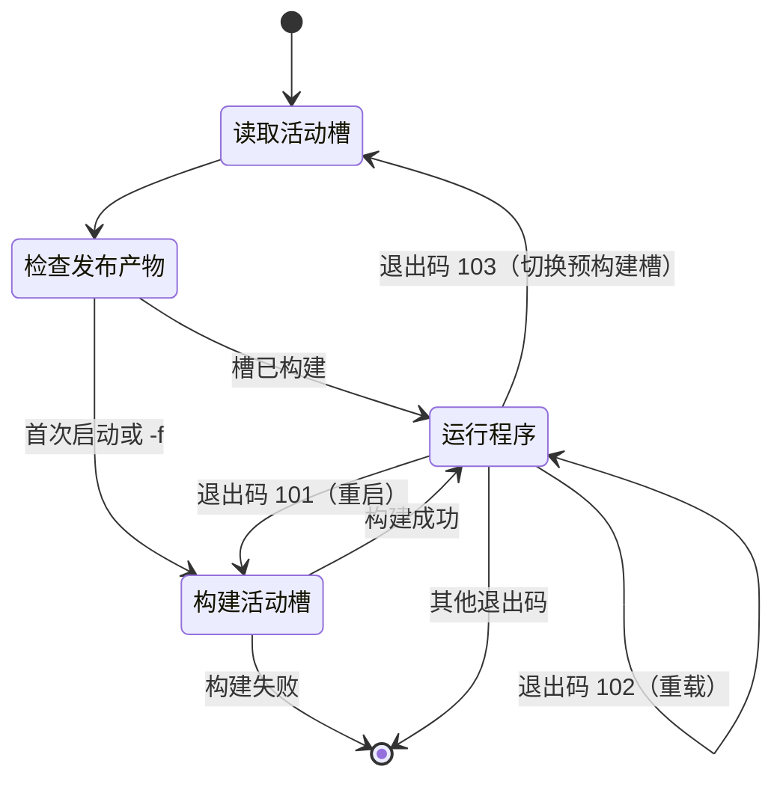

# 更新与重启

Linux 部署以 `launch.sh` 为入口。它是常驻父进程，负责运行发布产物、识别程序请求的动作，并在需要时重建或切换发布槽。

## 日常操作

| 目标 | 操作 | 结果 |
| --- | --- | --- |
| 正常启动 | `./launch.sh` | 启动活动槽；首次运行会先构建 |
| 强制重建 | `./launch.sh -f` | 重建活动槽后启动 |
| 不编译重启 | WebUI「重载程序」或群聊 `/reload` | 当前槽直接再次启动 |
| 编译后重启 | WebUI「重启程序」 | 重建当前槽后启动 |
| 拉取并更新 | WebUI「更新版本」或授权用户执行 `/update [-f]` | 构建备用槽并切换 |

群聊的 `/update`、`/reload` 会校验 `AuthorizedUser`。WebUI 没有身份鉴别，只能由可信本机用户访问；访问边界见[日志与数据](logs-data.html)。

## `launch.sh` 做什么

脚本管理 `build/slot_a` 和 `build/slot_b` 两个发布目录，`build/active_slot` 只保存当前要启动的槽名。

启动时，它读取活动槽；槽不存在时调用 `build.sh` 发布，然后执行该目录内的 `MerryBot`。程序结束后，脚本根据退出码决定下一步，而不是无条件重启。

| 退出码 | 程序请求 | 脚本动作 |
| --- | --- | --- |
| 101 | 重启 | 重建当前活动槽，再启动 |
| 102 | 重载 | 不编译，直接再次启动当前槽 |
| 103 | 使用预构建版本 | 重新读取 `active_slot`，启动已准备好的备用槽 |
| 其他 | 正常退出或故障 | 结束 `launch.sh` |

直接运行发布目录中的 `MerryBot` 或 `dotnet run` 不会处理这些退出码，因此 Linux 服务应由 `./launch.sh` 托管。

### 状态机

## A/B 双槽更新

双槽思路类似 Android A/B 更新：**运行中的槽不动，新版本先写入另一个槽，成功后才切换入口。**

假设当前活动槽是 A：

1. `HostLifecycle` 获取 git 更新，在未运行的槽 B 调用 `build.sh`。
2. 构建期间，槽 A 的机器人继续运行。
3. 槽 B 构建成功后，程序写入 `build/active_slot = B`，再以退出码 103 结束。
4. `launch.sh` 读取新的活动槽并启动 B；槽 A 的旧发布产物保留。

| 时机 | 槽 A | 槽 B | `active_slot` |
| --- | --- | --- | --- |
| 更新前 | 正在运行 | 上次发布产物或空 | `A` |
| 构建中 | 继续运行，不改动 | 发布新版本 | `A` |
| 构建成功 | 保留旧版本 | 新版本已就绪 | 切为 `B` |
| 重启后 | 旧版本保留 | 启动新版本 | `B` |

下次更新反向使用 A。构建失败不会覆盖运行中的槽，也不会修改 `active_slot`。

## 边界

`/update [-f]` 与 WebUI 更新共用 `HostLifecycle`：获取 git 更新、构建备用槽、切换活动槽并请求 103 重启。`-f` 传给更新逻辑，用于强制执行更新流程。

## 相关页面

- [部署与运行](deployment.html) — 首次发布与数据目录
- [日志与数据](logs-data.html) — 日志、备份和访问边界
- [启动配置](../configuration/startup.html) — WebUI 监听地址
